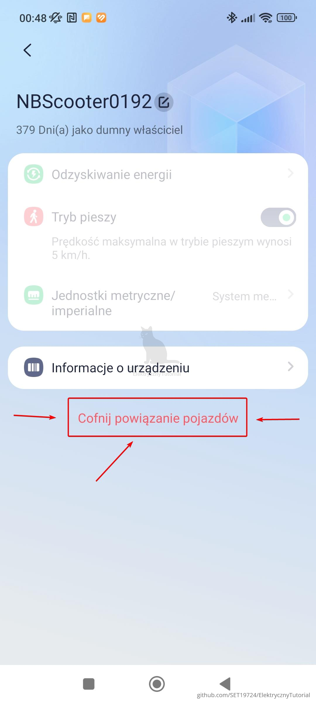
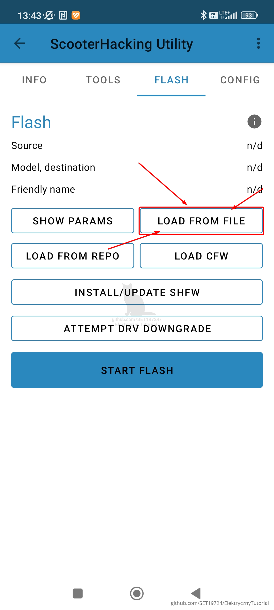
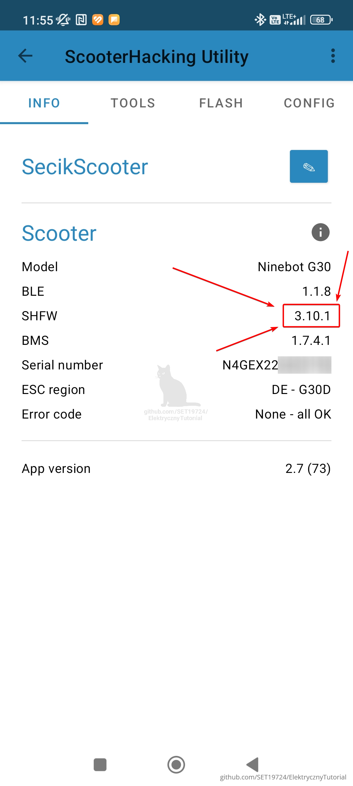
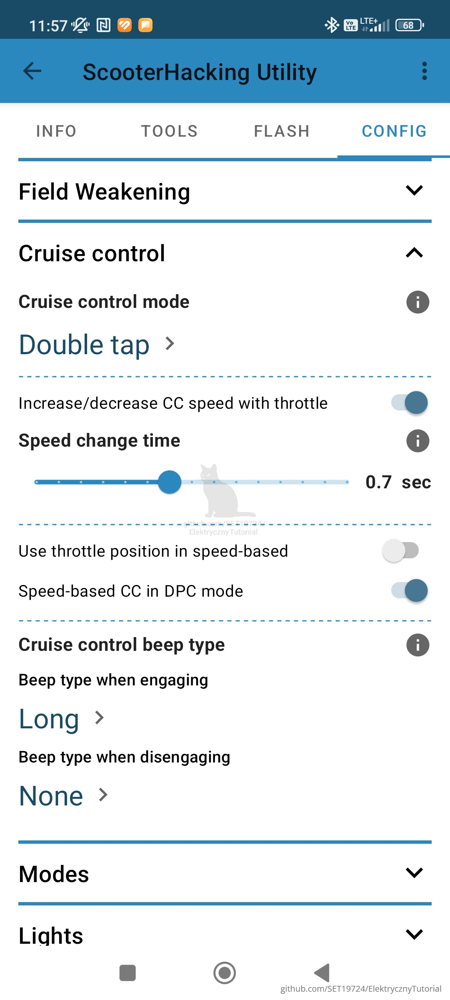

# 🔧 Odblokowanie hulajnogi Ninebot – wersja BETA
**Aktualizacja:** 20.04.2025
// Opracowanie stworzone w 2dni może zawierać błedy jeśli widzisz błąd daj znać ;)

> ⚠️ **Zastrzeżenie prawne**  
>  
> Niniejszy materiał został stworzony wyłącznie w celach edukacyjnych.  
> Autor nie ponosi odpowiedzialności za jakiekolwiek uszkodzenia sprzętu, błędne użycie instrukcji czy skutki wynikające z modyfikacji opisanych w tym dokumencie.  
>  
> Wszystkie czynności wykonujesz na **! WŁASNE RYZYKO I ODPOWIEDZIALNOŚĆ !**.  
>  
> Jest to jedynie tłumaczenie i opracowanie ogólnodostępnych informacji w języku polskim.

---

## 📌 Obsługiwane modele

- Ninebot Max G2  ✅
- Ninebot Max G30  ✅
- Ninebot  F2  ✅
- Ninebot  F20  
- Ninebot  F25  
- Ninebot  F30  
- Ninebot  F40  ✅
- Ninebot  E22  
- Ninebot  E25  
- Ninebot  E45  

>*Dane oparte na opisie z filmu.*
>W przypadku modeli F20,F25,F30,F40 -Jest problemos.
>Musisz po wgraniu shfw użyć starej wersji aplikacji 2.5 do konfiguracji inaczej źle będą wskakiwać ustawienia

>Jeśli widzisz obok strzałkę to według użytkowników udało im się odblokować dany model

---
## 📚 Spis treści

- 🔧 [Obsługiwane modele](#obslugiwane-modele)
- 🔓 [Obsługiwane wersje firmware](#obsługiwane-wersje-firmware)
- 🎉 [Dołącz do Discorda](#dolacz-do-naszego-discorda)
- 📽️ [Poradnik wideo od Mc Kuc](#poradnik-wideo)
- ⚙️ [Proces odblokowania](#proces-odblokowania)
- 🎯 [Co teraz po odlokowaniu?](#co-teraz)
- 🌍 [Zmiana regionu](#region)
- 🛴 [Lista prefixów numerów seryjnych](#lista-prefixow-numerow-seryjnych)
- ✨ [Złoty numer seryjny G30](#zloty-numer-seryjny)
- 📊 [F2 / F2 Plus / F2 Pro – prędkości](#f2-f2-plus-f2-pro-sport-predkosci)
- ℹ️ [Dodatkowe info](#dodatkowe-info)
- 🔁 [Jak zmienić region?](#jak-zmienic-region)
- 🚀 [Jak wgrać SHFW (Custom Firmware)](#jak-wgrac-shfw-custom-firmware)
- ⚙️ [Ustawianie SHFW](#ustawianie-shfw)
- 🧠 [WAŻNE jeśli masz Silnik nowej generacji G30 WAŻNE](#silnik-gen3-g30)
- 🔧 [Zalecana wymiana na: łączniki MR60](#kable)
- ✅ [Zalecane ustawienia SHFW wg poradnika od lekrsu](#zalecane-ustawienia-lekrsu)
- 📚 [Źródła](#zrodla)

---

## ❓ Czy potrzebuję programatora ST-LINK?
**Nie!** Jest to najnowsza metoda, która nie wymaga użycia ST-LINKa.

---

## 🔓 Obsługiwane wersje firmware

Obecnie **nie ma ograniczeń** dotyczących wersji firmware.  
Nawet jeśli masz wersję **1.8.1**, metoda powinna zadziałać bez problemu.

---

## 🎉 Dołącz do Discorda!

Zapraszam na **kanał Discord poświęcony hulajnogom Ninebot**!  
Fajnie było by stworzyć aktywną, **polską społeczność**, która wspiera się wzajemnie w tematach:

- 🔧 Modyfikacje i naprawy  
- 🚀 Odblokowywanie prędkości  
- 🛠️ Diagnostyka  
- ❓ Pytania techniczne i porady  
- 💬 Luźne rozmowy i dzielenie się doświadczeniem  

**Dołącz już teraz:**  
👉 [https://discord.gg/k69Y4wBfxM](https://discord.gg/k69Y4wBfxM)

*Im nas więcej, tym lepiej – razem łatwiej rozwiązywać problemy i rozwijać pasję!*

---

## 📽️ **Poradnik wideo**  
Ten poradnik oparty jest w dużej mierze na materiale z YouTube od użytkownika [Mc Kuc](https://www.youtube.com/@McKuc), który pokazuje krok po kroku nową metodę odblokowania:

---

## ⚙️ Proces odblokowania

### 1. Pobierz aplikację ScooterHacking Utility
👉 PLATFORMA ANDROID [https://utility.cfw.sh](https://utility.cfw.sh)

⚠️ **Co jeśli nie mam androida tylko Iphone ?**  
>Możesz użyć projektu Luna który znajduje sie na https://luna.cfw.sh obecnie poradnik pokazuje tylko jak zrobić to na android ale zasada działania jest taka sama.
Różni się tylko interfejs

- Po uruchomieniu aplikacji wybierz swoją hulajnogę.
  *(Włącz hulajnogę oraz Bluetooth w telefonie)*

  

- Kliknij trzy kropki w prawym górnym rogu.

  

- Wybierz opcję **"Hardware details"**.

  

- Skopiuj swój unikalny **UID**.

  

---

### 2. Odepnij hulajnogę od konta w oficjalnej aplikacji

- Przejdź do **Settings**.

  

- Na dole wybierz **"Unbind vehicle"**.

  

- Kliknij **"Unbind"** – aplikacja poprosi o e-mail przypisany do konta.

  

---

### 3. Uzyskanie plików od bota na Telegramie

- Otwórz Telegram i znajdź bota **@downgrade_ninebot**
  👉 [https://t.me/downgrade_ninebot](https://t.me/downgrade_ninebot)

#### Krok po kroku:
W skrócie:
1. Wpisz `/start`
2. Zaznacz **"I understand"**
3. Wybierz model hulajnogi
4. Wklej skopiowany UID
   > **Uwaga:** dokładność UID jest kluczowa — jedna pomyłka = nie odblokujesz
5. Poczekaj na wygenerowanie plików
6. Pobierz pliki

Tutaj ze screenami:

Piszemy /start
Zaznacz "I understand" po przeczytaniu informacji
Następnie wybieramy model

Bot zapyta o UID wklejamy ze schowka swój unikalny numer

Bot potrzebuje trochę czasu teraz czekamy może potrwać od 1 minuty do kilku dni zależnie od kolejki którą musi bot przetworzyć

Pobieramy przygotowany plik pod naszą hulajnogę naciskając na 3kropki

Po otrzymaniu plików kliknij trzy kropki i wybierz **"Download"**

---

### 4. Wgranie plików przez ScooterHacking Utility

1. W aplikacji wybierz zakładkę **FLASH**
2. Kliknij **"LOAD FROM FILE"**
3. Znajdź pobrany plik w pamięci telefonu i wybierz go

   

4. Kliknij **"START FLASH"**

   

> ⚠️ Nie oddalaj się od hulajnogi i jej nie wyłączaj – możesz ją uceglić! W takim wypadku pomoże tylko programator ST-LINK.
ZNACZENIE Uceglić – doprowadzić urządzenie (np. hulajnogę) do stanu, w którym nie reaguje na włączenie, nie uruchamia się, nie da się go normalnie naprawić ani przywrócić bez specjalistycznego sprzętu (np. ST-LINK, UART itp.).																																																												 

> ⚠️ **Uwaga – Jeśli masz Błąd „Data format error” podczas wgrywania pliku**  
>  
> - Sprawdź, czy **Twój MCU ID (UID)** jest poprawny i **zgadza się z hulajnogą**.  
> - Upewnij się, że hulajnoga **nie była wcześniej odblokowywana ani programowana ST-LINKiem** (np. przez poprzedniego właściciela).  
> - Metoda działa **tylko na oryginalnym kontrolerze** – jeśli masz podróbkę lub zamiennik z chin, proces się nie powiedzie.
> - W przypadku błędnego UID - wygeneruj nowe pliki na podstawie dobrego UID

Po zakończeniu pojawi się komunikat: **"FLASH COMPLETE!"**
Hulajnoga wyda sygnał dźwiękowy „bi-bip”.

✅ **Gotowe! Hulajnoga odblokowana!**

---

## 🎯 Co teraz?

Masz dwie opcje:

- 🔧 [Wgraj SHFW – custom firmware](#-jak-wgrać-shfw-custom-firmware)

  - Dużo opcji daje alternatywne oprogramowanie od https://scooterhacking.org
  - W skrócie możecie ustawić każdy tryb mocy pod siebie i osiągnąć wyższe prędkości
  - Personalizacja zachowania światła,wyłączenia hulajnogi,start bez odepchania,regulacja mocy hamowania elektronicznego hamulca,poziom baterii podany w liczbie a nie paskach i wiele więcej

- 🌍 [Zmień numer seryjny by:](#zmiana-regionu--poprzez-numer-seryjny)

  - Zmienić ograniczenia prędkości
  - Odblokować tempomat

Jeśli zmieniasz oprogramowanie na alternatywne SHFW korzystaj z aplikacji NineDash
 https://play.google.com/store/apps/details?id=adriandp.ninedash

Nie wiadomo czy aplikacja oryginalna nie wymusi automatycznej aktualizacji która ponownie zablokuje możliwości zmian dla zaawansowanych użytkowników

  > ⚠️ **Uwaga prawna**  
> Zmiana ograniczeń prędkości może naruszać lokalne przepisy dotyczące poruszania się hulajnogą elektryczną po drogach publicznych.  
>  
> Tak zmodyfikowany pojazd może być użytkowany **wyłącznie na terenie prywatnym i na własną odpowiedzialność**.  
>  
> Autor nie ponosi odpowiedzialności za skutki wynikające z nieprzestrzegania przepisów prawa ani za wyrządzone szkody.

---

## 🌍 Zmiana regionu

### Przykład struktury numeru seryjnego (G30):
N4GSD1939C0123

| Pozycja  | Fragment | Znaczenie                                      |
|----------|----------|------------------------------------------------|
| 1–3      | N4G      | Identyfikator produktu                         |
| 4        | S        | Wersja produktu / region                       |
| 5        | D        | Linia produkcyjna                              |
| 6–7      | 19       | Rok produkcji (np. `19` = 2019)                |
| 8–9      | 39       | Tydzień produkcji                              |
| 10       | C        | Rewizja produktu                               |
| 11–14    | 0123     | Unikalny numer seryjny                         |

>**Najważniejsze są 4 pierwsze znaki!**

---

### 📌 Przykłady zmian numerów seryjnych

#### G30:
- `N4GE` → DE (20 km/h)  
- `N4GS` → International (30 km/h) ← zalecana zmiana

#### G2:
- `01GZ` → DE, 20 km/h, bez tempomatu  
- `01GU` → US, 32 km/h, z tempomatem ← zalecana zmiana  

---

## 🛴 Lista prefixów numerów seryjnych

### G2:
| Prefix   | Region | Ograniczenie       |
|----------|--------|--------------------|
| 01GZ     | DE     | 20 km/h, brak CC   |
| 01GT/01GY| EU     | 25 km/h, brak CC   |
| 01GU/01GX| US     | 32–35 km/h, z CC   |
| 02GV     | EU     | 25 km/h, z CC      |
| 02GW     | EU     | 25 km/h, brak CC   |

### G30:
| Prefix   | Model                        | Prędkość  |
|----------|------------------------------|-----------|
| N4GS     | Max (WW)                     | 30 km/h   |
| N4GC     | Max (EU)                     | 25 km/h   |
| N4GE     | Max (DE, niebieski)          | 20 km/h   |
| N4GP     | Max (EU)                     | 25 km/h   |
| N4GN     | Max Lite (WW)                | 30 km/h   |
| N4GA/N4GO| Max Lite (EU)                | 25 km/h   |
| N4GM     | Max Lite (DE)                | 20 km/h   |
| N4GT     | Maserati MC                  | 25 km/h   |
| N4YC     | Seat Mó                      | 20 km/h   |
| NTG1     | Audi EKS                     | 20 km/h   |

>## ✨ Złoty numer seryjny

Jeśli zmienisz **pozycje 6–9** w numerze seryjnym na `1111`, np.:N4GSD1111C0123

...i zrestartujesz hulajnogę, odblokujesz **pełny potencjał fabrycznego oprogramowania**.

> To był numer testowy używany przez deweloperów – bez limitów prędkości i z aktywnym tempomatem.

---

## 📊 F2 / F2 Plus / F2 Pro (sortowane wg SPORT prędkości)

Tabele jaką znalazłem z oryginalnymi wartościami według numeru

| Prefix SN | ECO prędkość | ECO prąd | DRIVE prędkość | DRIVE prąd | SPORT prędkość | SPORT prąd | Model    | Czujnik temp. silnika (E41) |
|-----------|---------------|-----------|----------------|------------|----------------|------------|----------|-----------------------------|
| NAGK      | 15 km/h       | 9 A       | 20 km/h        | 18 A       | 22 km/h        | 26 A       | F2 Plus  | Nie                         |
| NAGE      | 15 km/h       | 9 A       | 20 km/h        | 18 A       | 22 km/h        | 24 A       | F2       | Nie                         |
| NAGU      | 15 km/h       | 9 A       | 20 km/h        | 18 A       | 25 km/h        | 28 A       | F2 Pro   | Tak                         |
| NAGT      | 12 km/h       | 9 A       | 20 km/h        | 18 A       | 25 km/h        | 28 A       | F2 Pro   | Tak                         |
| NAGD      | 15 km/h       | 9 A       | 20 km/h        | 18 A       | 25 km/h        | 24 A       | F2       | Nie                         |
| NAGC      | 12 km/h       | 9 A       | 20 km/h        | 18 A       | 25 km/h        | 24 A       | F2       | Nie                         |
| NAGJ      | 15 km/h       | 9 A       | 20 km/h        | 18 A       | 25 km/h        | 26 A       | F2 Plus  | Nie                         |
| NAGB      | 15 km/h       | 9 A       | 25 km/h        | 18 A       | 30 km/h        | 24 A       | F2       | Nie                         |
| NAGF      | 15 km/h       | 9 A       | 25 km/h        | 18 A       | 30 km/h        | 26 A       | F2 Plus  | Nie                         |
| NAGG      | 15 km/h       | 9 A       | 25 km/h        | 18 A       | 30 km/h        | 26 A       | F2 Plus  | Nie                         |
| NAGA      | 15 km/h       | 9 A       | 25 km/h        | 18 A       | 30 km/h        | 24 A       | F2       | Nie                         |
| NAGH      | 12 km/h       | 9 A       | 20 km/h        | 18 A       | 26 km/h        | 26 A       | F2 Plus  | Nie                         |
| NAGS      | 15 km/h       | 9 A       | 25 km/h        | 18 A       | 32 km/h        | 28 A       | F2 Pro   | Tak                         |
| NAGR      | 15 km/h       | 9 A       | 25 km/h        | 20 A       | 32 km/h        | 28 A       | F2 Pro   | Tak                         |

---

## ℹ️ Dodatkowe info

**Oznaczenia:**
- *with CC* – z tempomatem  
- *no CC* – bez tempomatu  
- **DE** – Niemcy  
- **EU** – Europa  
- **US** – USA  
- **WW** – Międzynarodowy  

---

## 🔁 Jak zmienić region?

1. Otwórz aplikację **ScooterHacking Utility**  
2. Przejdź do zakładki:  
   `TOOLS > CHANGE REGION`  

   

3. Wybierz gotowy region lub użyj opcji „CUSTOM” 

   

4. Wpisz pełny, poprawny numer seryjny (zgodnie z tabelą wyżej)  
5. Zatwierdź – hulajnoga uruchomi się ponownie

> ⚠️ Nie wpisuj przypadkowych numerów – użyj poprawnych kodów dla swojego modelu!

---

## 🚀 Jak wgrać SHFW (Custom Firmware)

  
  

Często pojawia się błąd **"Flashing failed"** — **nie panikuj!**  
SHFW najprawdopodobniej zostało poprawnie wgrane. Najlepiej w takim przypadku **wyłącz i włącz hulajnogę**.

Jeśli na ekranie pojawiają się cyfry, to oznacza poziom naładowania baterii.  
Przy 100% powinno wyświetlać się `A0`.

Po poprawnym wgraniu pojawi się wersja SHFW — jak na screenie poniżej.  
Dla pewności warto jeszcze raz powtórzyć proces flashowania.

  

---

## ⚙️ Ustawianie SHFW

> Jeśli tego nie zrobisz, hulajnoga **nie będzie jeździć**, ponieważ nie ma domyślnych ustawień!

Przejdź do zakładki **"CONFIG"**:

Rozwiń sekcję **Throttle** — tu ustawisz prędkość i ilość amperów dla poszczególnych trybów:

>🔸 **Uwaga**: Screen pokazuje tylko wygląd menu — nie kopiuj tych ustawień - polecane ustawienia znajdziesz niżej.

### 📋 Parametry do ustawienia:

- **Speed limit** – maksymalna prędkość hulajnogi  
- **Select mode** – wybór trybu (ECO / DRIVE / SPORT)  
- **Throttle mode** – najlepiej ustawić na `DPC`  
- **Power limit** – zależnie od modelu hulajnogi  

ℹ️ Po kliknięciu ikonki `i` przy każdej opcji wyświetli się szczegółowy opis w języku angielskim.

## 🧠 WAŻNE Silnik nowej generacji model G30 WAŻNE !

Jeśli posiadasz **nowszy silnik trzeciej generacji (Gen 3)** w hulajnodze G30, koniecznie zaznacz opcję **"New motor"** w zakładce `Motor config/Motor settings`.

🔍 **Nie jesteś pewien, którą wersję silnika masz?**  
Porównaj numer seryjny silnika który znajduje się na silniku przy kodzie QR (Motor Serial Number – SN) z poniższą tabelą:

| Numer seryjny silnika (SN)   | Generacja          | Modele                            |
|------------------------------|--------------------|-----------------------------------|
| Zaczyna się od `6`           | Pierwsza generacja | Większość starszych modeli        |
| Zaczyna się od `9`           | Druga generacja    | G30P, niektóre G30Lx              |
| Zawiera `PCAH`               | Trzecia generacja  | G30P                              |
| Zawiera `PAAH`               | Trzecia generacja  | G30E                              |
| Zawiera `PADH` lub `PADJ`    | Trzecia generacja  | G30D                              |

> ✅ **Wniosek:** Jeśli twój numer silnika zawiera `PCAH`, `PAAH`, `PADH` lub `PADJ`, **masz silnik Gen 3** i musisz zaznaczyć odpowiednią opcję w konfiguracji!
Inaczej będą dziwne dźwięki + koło nie będzie jeździć

---

## 🔌 Bullet connectors w Ninebot G30 – znany problem i rekomendowana wymiana

W hulajnodze Ninebot G30 oryginalne łączniki typu “bullet” (wpinane kable zasilające silnik) często okazują się **niewystarczające** do bezpiecznego przesyłu prądu, szczególnie po modyfikacjach firmware czy podniesieniu parametrów.  
 - Były stosowane w pierwszej generacji

### 🛑 Co się dzieje?
- **Przegrzewanie się styków** przy większym obciążeniu  
- **Topienie izolacji** lub samego metalu konektora  
- Ryzyko **przerwy w zasilaniu** lub uszkodzenia przewodów  

Ten problem jest **powszechnie zgłaszany** przez użytkowników G30, zwłaszcza tych, którzy wgrywają custom firmware i zwiększają amperaż silnika.
 - Ale dotyczy też zwykłych użytkowników

 
 

---

## 🔧 Zalecana wymiana na: łączniki MR60

Aby uniknąć przegrzewania i zapewnić bezpieczny, stały przepływ prądu, warto wymienić oryginalne konektory na **łączniki MR60** (lub alternatywę wytrzymującą wysokie obciążenia):

| Cecha                  | Oryginalne bullet | MR60                  |
|------------------------|-------------------|-----------------------|
| Maksymalny prąd        | ~30 A             | do 60 A i więcej      |
| Materiał styków        | cienki stop miedzi| pozłacane mosiężne    |
| Izolacja               | PVC, cienka       | nylonowe, grubsze     |
| Trwałość połączenia    | dość niska        | wysoka                |
| Bezpieczeństwo         | ryzyko przegrzania| bezpieczne do 60 A    |

### 📌 Zalety MR60
- **Większa nośność prądu** – pewność działania przy podwyższonym amperażu  
- **Lepsze styki** – niższy opór, mniejsze nagrzewanie  
- **Trwalsza izolacja** – odporna na wysokie temperatury  
- **Prostszy montaż** – pasują na kable 8 AWG–10 AWG  

> ⚠️ **Uwaga**: Wymiana konektorów wymaga precyzyjnego lutowania lub użycia odpowiednich zaciskarek.  
> Jeśli nie masz doświadczenia w lutowaniu, zleć to specjaliście.

✏️ **Podsumowanie**  
Znany problem “topiących się” oryginalnych bullet connectors w G30 można łatwo rozwiązać, montując solidne łączniki MR60, które wytrzymują większy prąd nawet po podkręceniu parametrów.  

---

## ✅ Zalecane ustawienia wg poradnika od lekrsu
  https://github.com/lekrsu/shfw-walkthrough

Dla modeli: **G30, G2, F2**  
Aby osiągnąć maksymalną wydajność:

### 🧠 Ustawienia ogólne:
Ustawiacie sobie po kolei 3 tryby czyli ECO,DRIVE,SPORT
- Włącz **Expert View** (w prawym górnym rogu)
-W zakładce Throttle
-Naciśnij BUILD CURVE

- Tryb SPORT:
  - DPC: **25A**
  - Krzywa: pełna kwadratowa (Quadratic na max w prawo = 1.0)
- Pozostałe tryby: niższe ustawienia (Ja zalecam 10A ECO,16 DRIVE,25A SPORT)
- Ograniczenie prędkości: **wyłączone (0 km/h)**(Przy innych trybach niż sport warto ustawić preferowaną wartość)
- Acceleration boost: **100%** (Tutaj zalecam stopniowo zwiększać aż się przyzwyczaicie na start np.30%)
- Brake boost: **50%**
- Włącz **Overmodulation** dla SPORT/DRIVE(dla obu lub tylko jednego) (Daje wyższe prędkości kosztem szybszego rozładowania baterii)

---

### 🧲 Field Weakening (Osłabienie pola magnetycznego)

**Do normalnego użytku:**
- Prędkość: 20 km/h
- Initial: 0A
- Variable: 1200

**Dla wyższej efektywności (niższe zużycie baterii):**
- Prędkość: 20 km/h
- Initial: 0A
- Variable: 600

**Dla szczytowej prędkości (może powodować problemy):**
- Prędkość: 20 km/h
- Initial: 0A
- Variable: 2000

### Brake Hamulce

Warto w tej zakładce ustawić autobraking na 6A

Da nam to automatyczne hamowanie podobne do oryginału

---

### 🛞 Kalibracja kół - Realne prędkości na liczniku
Znajdziecie to ustawienie w "Motor settings"
Domyślny rozmiar kół w modelach g30 Max to **10"**, ale ustaw:

- **G30** → `9.3"`
- **G2 i F2** → `9.7"`

> Dzięki temu prędkość na wyświetlaczu będzie bardziej zgodna z rzeczywistą (GPS).

---

### ⚙️ Silnik

- Dla G30 Ustaw **Motor frequency**: `20 kHz` lub `24 kHz`  
  (dla G2 i F2 nie ma tej opcji nic nie rób)

### 🔋 Ograniczenia nowszych modeli

Niektóre nowe G30 z nowszym BMS mają ograniczenie prądu baterii do **28A**  
→ przez co będą miały gorsze osiągi niż starsze modele (z limitem **40A**)

---

###  Prędkość startu / Start bez odpychania
- Jest to prędkość gdy odpychasz się i dopiero hulajnoga reaguje na przycisk od gazu
-Domyślnie jest ustawione na 5km/h
-Możesz zmienić według tego jak ci pasuje
-Jeśli chcesz ruszać bez odpychania zmieniasz na 0km/h

---

## 🛠️ Ustawienia tempomatu (Cruise Control)

				   
Funkcja **Cruise Control** (tempomat) oferuje cztery tryby działania:

- **Off** – tempomat wyłączony  
- **Time** – tempomat włącza się po określonym czasie (ustawianym przez użytkownika)  
- **Single tap** – tempomat aktywuje się po jednokrotnym naciśnięciu manetki gazu  
- **Double tap** – tempomat aktywuje się po dwukrotnym szybkim naciśnięciu manetki gazu  (trzeba wyczuć czasem do połowy wciskam żeby łapało)(tą opcję polecam)

---

### 🔄 Zmiana prędkości tempomatu za pomocą manetki(Opcja Increase/decrease CC speed with throttle:):

- Wciśnięcie manetki **poniżej 30% przez 0,75 sekundy** → prędkość zmniejsza się o **1 km/h**
- Wciśnięcie manetki **powyżej 50% przez 0,75 sekundy** → prędkość zwiększa się o **1 km/h**

> ✅ Działa tylko w trybie **Speed-based** (opartym na prędkości)

W trybie **Speed-based CC w trybie DPC**, tempomat utrzymuje prędkość również w trybie opartym na mocy.

- Najlepszym wytłumaczeniem tego jest gdy naciśniesz lekko na gaz i przytrzymasz zmniejsza prędkość o 1 ustawioną na tempomacie
- Gdy wcisniesz do samego końca zwiększa lub powyżej 50% zakresu prędkość o 1 w górę
- Tak długo jak trzymasz słyszysz piknięcie i zmienia zadaną Prędkość
- Aby wyłączyć tempomat po prostu ciągniemy lekko za hamulec i to dezaktywuje

---

## 🔊 Dźwięki aktywacji i dezaktywacji tempomatu

Możesz wybrać, jaki sygnał dźwiękowy będzie odtwarzany przy **włączeniu** i **wyłączeniu** tempomatu:

| Ustawienie     | Opis                                      |
|----------------|-------------------------------------------|
| **None**       | Brak jakiegokolwiek dźwięku               |
| **Single**     | Krótkie pojedyncze „piknięcie”   (Tą opcję polecam)         |
| **Long**       | Dłuższy sygnał dźwiękowy                  |
| **Double**     | Podwójne krótkie „piknięcia”              |
| **Extra long** | Bardzo długi, ciągły sygnał dźwiękowy     |

---

## 💡 Ustawienia oświetlenia (Light Mode)

Oświetlenie hulajnogi może być dostosowane do własnych preferencji.  
Dostępne są następujące tryby działania światła hamowania (światło tylne):

| Tryb       | Opis                                                                 |
|------------|----------------------------------------------------------------------|
| **Default**  | Światło hamowania **miga**, gdy naciskasz hamulec, z ustawioną częstotliwością migania *(Brake light flash speed)*. |
| **Static**   | Światło hamowania jest **połączone z przednim światłem** – jeśli włączysz przednie światło, tylne również świeci. |
| **Reversed** | Światło hamowania **miga**, dopóki nie naciśniesz hamulca – wtedy **gaśnie**. |
| **Strobe**   | Tworzy **efekt stroboskopowy** światła hamowania, z ustawioną częstotliwością migania. |
| **German**   | Tylne światło jest **zawsze włączone**, a tylko przednie można włączać i wyłączać. |
| **Car**      | Światło hamowania działa jak w samochodzie – zapala się **tylko w momencie nacisku hamulca** (jak w modelu Max G2). |

> 🛠️ Ustawienie częstotliwości migania znajdziesz pod parametrem **Brake light flash speed**

---

## ⚙️ System Settings / Ustawienia systemu

### 🕒 Shutdown Time Settings

Tutaj możesz ustawić, po jakim czasie hulajnoga ma się automatycznie wyłączyć:

- **Auto-shutdown delay** – opóźnienie automatycznego wyłączenia podczas normalnego użytkowania - Czyli kiedy zostawiasz ją włączoną po jakim czasie sama się wyłączy
- **Auto-shutdown delay when locked** – opóźnienie automatycznego wyłączenia, gdy hulajnoga jest **zablokowana** -Czyli kiedy zostawiasz ją włączoną i aktywujesz blokadę(żeby nikt jej nie ruszał) po jakim czasie sama się wyłączy (Tutaj zalecam ustawić na MAX)--Pamiętaj że po określonym czasie ona sama się odblokuje i ktoś może sobię włączyć i odjechać brum brum sadcat ;)

## 📚 Źródła:

- https://www.youtube.com/watch?v=WXCJJVfrrk0  
- https://github.com/lekrsu/shfw-walkthrough  
- https://wiki.scooterhacking.org/doku.php?id=nbmax  
- https://rollerplausch.com/threads/f2-series-informationen-firmware-hardware-tuning.11004/
- https://rollerplausch.com/threads/shfw-anleitung-2025-scooterhacking-utility-ninebot-xiaomi-e-scooter-tuning.3753/

>License/Licencja:CC BY-NC-SA 4.0
Dodanie licencji która zakazuje użytku komercyjnego CC BY-NC-SA 4.0
- Wiedza jest dla każdego a nie januszy interesu co będą na tym zarabiać
---
