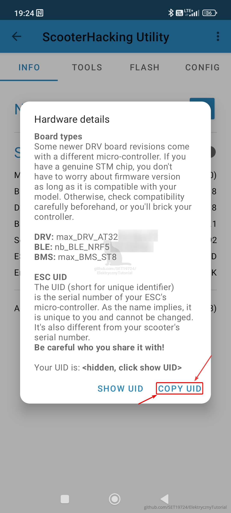
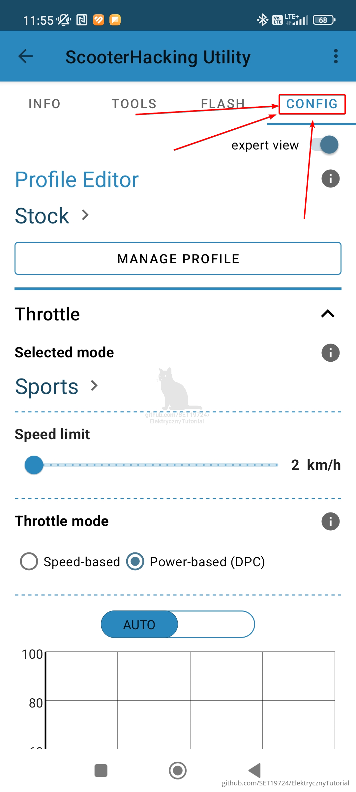
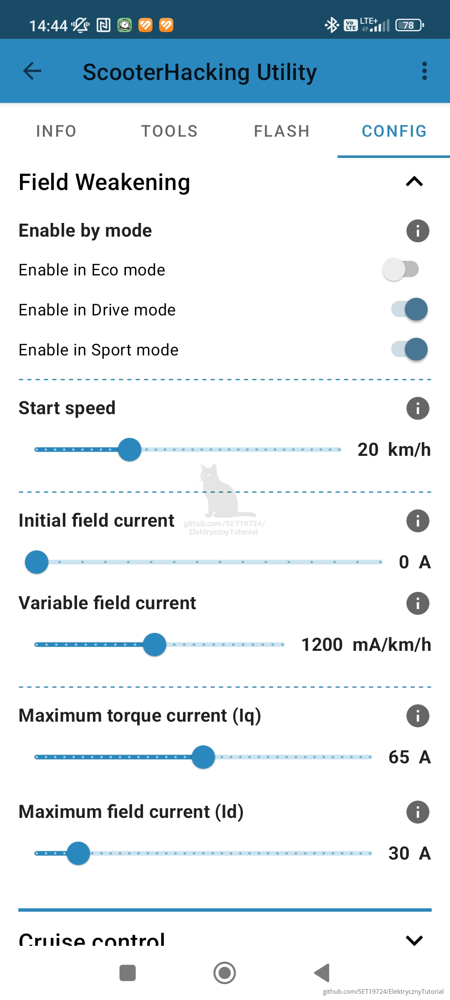
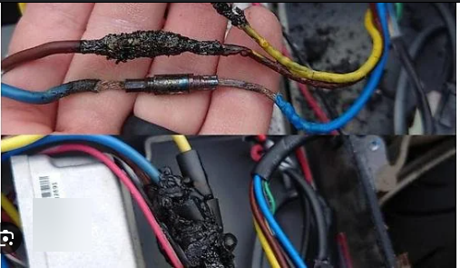
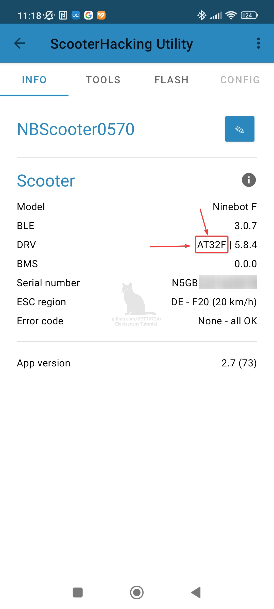
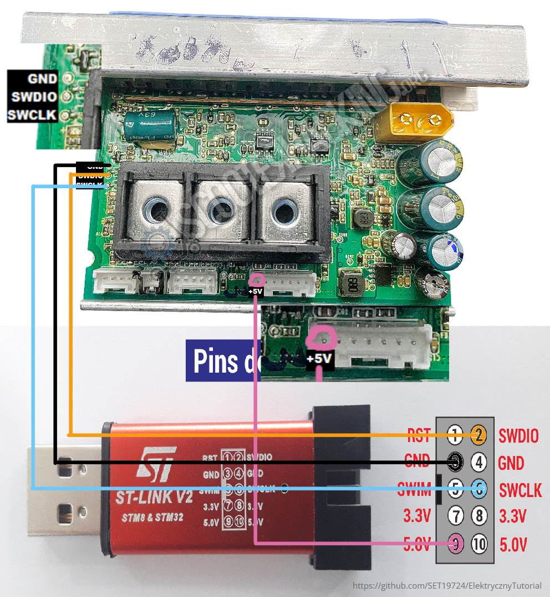
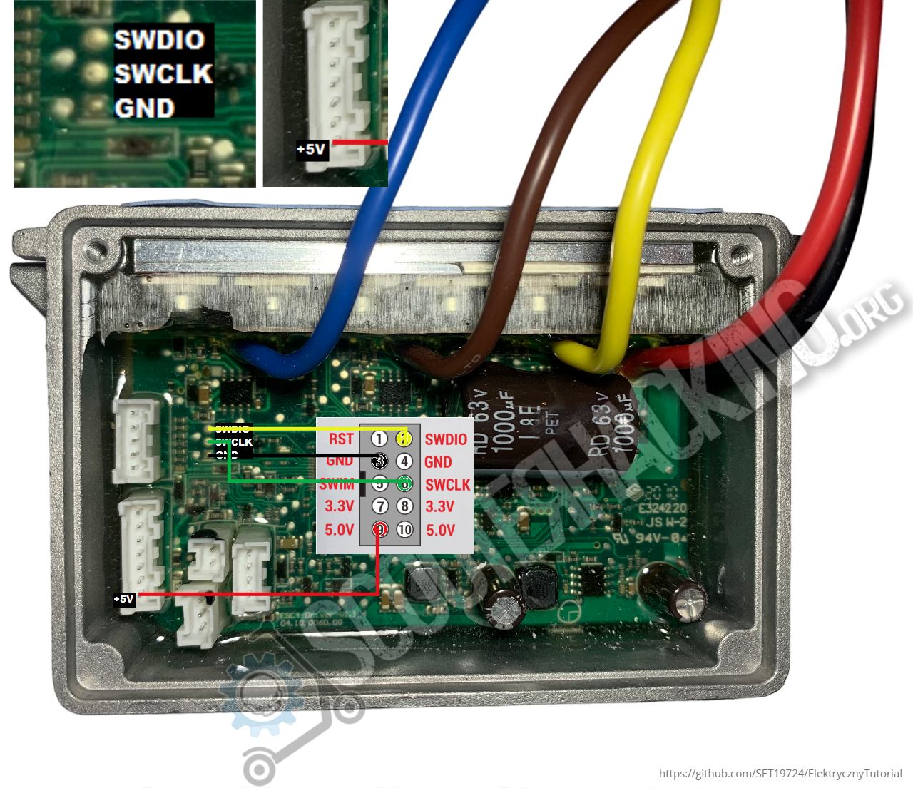

# 🔧 Odblokowanie hulajnogi Ninebot +MiniWIKI – wersja BETA
**Aktualizacja:** 02.05.2025
// Może zawierać błedy jeśli widzisz błąd daj znać najlepiej na discord ;)

---

🌐 **Wersje językowe (automatyczne tłumaczenia przez Google Translate):**

- 🇵🇱 Polski (Oryginał)
- EN [English](https://translate.google.com/translate?sl=pl&tl=en&u=https://github.com/SET19724/ElektrycznyTutorial)
- 🇪🇸 [Español](https://translate.google.com/translate?sl=pl&tl=es&u=https://github.com/SET19724/ElektrycznyTutorial)
- 🇩🇪 [Deutsch](https://translate.google.com/translate?sl=pl&tl=de&u=https://github.com/SET19724/ElektrycznyTutorial)

> ⚠️ Wszystkie tłumaczenia generowane przez sztuczną inteligencję.  
> 🧠 Jeśli coś brzmi dziwnie, to wina robota, nie autora - ***chociaż może być to jednak wina autora. ;)***  
> 💡 Protip: otwórz w przeglądarce na komputerze — mobilny GitHub nie lubi translate'a.
---

> ⚠️ **Zastrzeżenie prawne**  
>  
> Niniejszy materiał został stworzony wyłącznie w celach edukacyjnych.  
> Autor nie ponosi odpowiedzialności za jakiekolwiek uszkodzenia sprzętu, błędne użycie instrukcji czy skutki wynikające z modyfikacji opisanych w tym dokumencie.  
>  
> Wszystkie czynności wykonujesz na **! WŁASNE RYZYKO I ODPOWIEDZIALNOŚĆ !**.  
>  
> Jest to jedynie tłumaczenie i opracowanie ogólnodostępnych informacji w języku polskim.

---

## 💖 Pomóż mi tworzyć dalej 💖

Ten projekt powstał z **pasji i chęci pomocy innym** – może właśnie **Tobie**.  
Jeśli **pomogłem Ci w czymś ważnym**, możesz się odwdzięczyć symbolicznie:  
**☕ kawą, 🍺 piwkiem albo energetykiem ⚡ – wybór należy do Ciebie!**

### 🧠 Twoje wsparcie:

- **Pozwala rozwijać** ten i kolejne projekty 🚀  
- **Pokazuje, że to co robię, ma sens** ❤️  
- **Realnie wpływa** na to, co mogę dać innym.
- **Motywuje** mnie do działania i częstych aktualizacji 🔄  
- **Pomaga kolejnym osobom**, którym może się to przydać 🙌  
- **Dajesz mi znak, że to działa i warto** 👏

### 📲 **Wsparcie przez Revolut:**

1. **Nazwa użytkownika**: `@nekkogamma`  
2. **Bezpośredni link** do darowizny:  
   [Kliknij tutaj, aby wesprzeć](https://revolut.me/nekkogamma)

3. **Revolut QR** (skanowanie):  

🔗 **Alternatywnie**:  
[revolut.me/nekkogamma](https://revolut.me/nekkogamma)

  

> **Serio. Dzięki! 🥹**

---

## 📌 Obsługiwane modele

- Ninebot Max G2  ✅
- Ninebot Max G30  ✅
- Ninebot  F2  ✅
- Ninebot  F20  ✅
- Ninebot  F25  
- Ninebot  F30  
- Ninebot  F40  ✅
- Ninebot  E22  
- Ninebot  E25  
- Ninebot  E45  

> ⚠️ **Uwaga:** Jeśli widzisz obok strzałkę ✅ to według użytkowników udało im się odblokować dany model

---

## 📚 Spis treści

### 🌍 Wstępne informacje
- 🔧 [Obsługiwane modele](#obslugiwane-modele)
- 🔓 [Obsługiwane wersje firmware](#obsługiwane-wersje-firmware)
- 🎉 [Dołącz do Discorda](#dolacz-do-discorda)

### 🔧 Odblokowywanie
- 📽️ [Poradnik wideo od Mc Kuc](#poradnik-wideo)
- ⚙️ [Proces odblokowania Bot](#proces-odblokowania)
- ⚙️ [[Alternatywa] Proces odblokowania programatorem ST-Link](#stlink)

### 🛠️ Po odblokowaniu i konfiguracja

- 🎯 [Co teraz po odlokowaniu?](#co-teraz)
- 🚀 [Jak wgrać SHFW (Custom Firmware)](#jak-wgrac-shfw-custom-firmware)
- ⚙️ [Ustawianie SHFW](#ustawianie-shfw)
- ✅ [Zalecane ustawienia SHFW wg poradnika od lekrsu](#zalecane-ustawienia)
- ⚙️ [Obsługiwane modele SHFW-Changelog](#shfwwsparcie)
- 🧠 [WAŻNE jeśli masz Silnik nowej generacji G30 WAŻNE](#silnik-g30)
- ⚙️ [Jak wgrać fabryczne oprogramowanie ?](#powrotdostock)

### 🌍 Region i numery seryjne

- 🌍 [Zmiana regionu](#region)
- 🔁 [Jak zmienić region?](#jak-zmienic-region)
- 🛴 [Lista prefixów numerów seryjnych](#lista-prefixow-numerow-seryjnych)
- 📊 [F2 / F2 Plus / F2 Pro – prędkości i oznaczenia](#f2-f2-plus-f2-pro-sport-predkosci)

### 🔧 Techniczne informacje

- 🔧 [Typy kontrolerów DRV/ESC](#kontrolery)
- 🔧 [Zalecana wymiana na: łączniki MR60 lub MT60](#kable)
- 🔧 [Kody błędów W BUDOWIE](#errorkody)
- 🔧 [Jak wrócić do oryginalnego oprogramowania(W BUDOWIE)](#powrotstock)

### ℹ️ Inne

- ℹ️ [Dodatkowe info](#dodatkowe-info)
- 📚 [Źródła](#zrodla)

---

## ❓ Czy potrzebuję programatora ST-LINK?
**Nie!** Jest to najnowsza metoda, która nie wymaga użycia ST-LINKa.
> Sposób jednak lub działa nie możesz odpiąć konta z jakiegoś powodu ?
- [Alternatywa czyli odblokowanie przez ST-LINK - stara metoda sekcja obecnie W BUDOWIE](#stlink)

---

## 🔓 Obsługiwane wersje firmware

Obecnie **nie ma ograniczeń** dotyczących wersji firmware.  
- Nawet jeśli masz wersję **1.8.11**, metoda powinna zadziałać bez problemu. modele G30,G2

---

## 🎉 Dołącz do Discorda!

Zapraszam na **kanał Discord poświęcony hulajnogom Ninebot**!  
Fajnie było by stworzyć aktywną, **polską społeczność**, która wspiera się wzajemnie w tematach:

- 🔧 Modyfikacje i naprawy  
- 🚀 Odblokowywanie prędkości  
- 🛠️ Diagnostyka  
- ❓ Pytania techniczne i porady  
- 💬 Luźne rozmowy i dzielenie się doświadczeniem  

**Dołącz już teraz:**  
👉 [https://discord.gg/k69Y4wBfxM](https://discord.gg/k69Y4wBfxM)

*Im nas więcej, tym lepiej – razem łatwiej rozwiązywać problemy i rozwijać pasję!*

---

## 📽️ **Poradnik wideo**  
Metoda odblokowania jest w dużej mierze oparta na materiale z YouTube od użytkownika [Mc Kuc](https://www.youtube.com/@McKuc), który pokazuje krok po kroku nową metodę odblokowania:
 - Podany sposób pojawiał się już wcześniej na grupach moderskich
 - Polecam obejrzeć również inne filmy tego użytkownika pokazuje również sposób odblokowania poprzez ST-LINK
 - Jeden z jego filmów już pomógł mi kiedyś jak zaczynałem przygodę za co chciałbym bardzo podziękować Mc Kuc  <3

---

## ⚙️ Proces odblokowania

### 1. Pobierz aplikację ScooterHacking Utility
👉 PLATFORMA ANDROID [https://utility.cfw.sh](https://utility.cfw.sh)

⚠️ **Co jeśli nie mam androida tylko Iphone ?**  
>Możesz użyć projektu Luna który znajduje sie na https://luna.cfw.sh obecnie poradnik pokazuje tylko jak zrobić to na android ale zasada działania jest taka sama.
Różni się tylko interfejs

- Po uruchomieniu aplikacji wybierz swoją hulajnogę.
  *(Włącz hulajnogę oraz Bluetooth w telefonie)*

  

- Kliknij trzy kropki w prawym górnym rogu.

  

- Wybierz opcję **"Hardware details"**.

  

- Skopiuj swój unikalny **UID**.

  

---

### 2. Odepnij hulajnogę od konta w oficjalnej aplikacji

- Przejdź do **Settings**.

  

- Na dole wybierz **"Unbind vehicle"**.

  

- Kliknij **"Unbind"** – aplikacja poprosi o e-mail przypisany do konta.

  

---

### 3. Uzyskanie plików od bota na Telegramie

- Otwórz Telegram i znajdź bota **@downgrade_ninebot**
- Lub użyj linku  👉 [https://t.me/downgrade_ninebot](https://t.me/downgrade_ninebot)

#### Krok po kroku:
 - **Przebieg w skrócie:**
1. Wpisz `/start`
2. Zaznacz **"I understand"**
3. Wybierz model hulajnogi (jeśli nie widzisz sprawdź `Lab`)
4. Wklej skopiowany UID
   > ⚠️ **Uwaga:** dokładność UID jest kluczowa — jedna pomyłka = nie odblokujesz
5. Poczekaj na wygenerowanie plików
6. Pobierz pliki

**Tutaj ze screenami:**

 - Piszemy /start

 - Zaznacz "I understand" po przeczytaniu informacji

 - Następnie wybieramy model

Bot zapyta o UID wklejamy ze schowka swój unikalny numer

Bot potrzebuje trochę czasu teraz czekamy może potrwać od 1 minuty do kilku dni zależnie od kolejki którą musi bot przetworzyć

Pobieramy przygotowany plik pod naszą hulajnogę naciskając na 3kropki

Po otrzymaniu plików kliknij trzy kropki i wybierz **"Download"**

---

### 4. Wgranie plików przez ScooterHacking Utility

1. W aplikacji wybierz zakładkę **"FLASH"**
2. Kliknij **"LOAD FROM FILE"**

   

3. Znajdź pobrany plik w pamięci telefonu i wybierz go
4. Kliknij **"START FLASH"**

   

> ⚠️ **Uwaga:** Nie oddalaj się od hulajnogi i jej nie wyłączaj – możesz ją uceglić! W takim wypadku pomoże tylko programator ST-LINK lub wymiana.
ZNACZENIE Uceglić – doprowadzić urządzenie (np. hulajnogę) do stanu, w którym nie reaguje na włączenie, nie uruchamia się, nie da się go normalnie naprawić ani przywrócić bez specjalistycznego sprzętu (np. ST-LINK, UART itp.).																																																												 

**Zaczekaj aż proces wgrywania się zakończy nie ruszaj nic**

> ⚠️ **Uwaga – Jeśli masz Błąd „Data format error” podczas wgrywania pliku**  
>  
> - Sprawdź, czy **Twój MCU ID (UID)** jest poprawny i **zgadza się z hulajnogą**.  
> - Upewnij się, że hulajnoga **nie była wcześniej odblokowywana ani programowana ST-LINKiem** (np. przez poprzedniego właściciela).  
> - Metoda działa **tylko na oryginalnym kontrolerze** – jeśli masz podróbkę lub zamiennik z chin, proces się nie powiedzie.
> - W przypadku błędnego UID - wygeneruj nowe pliki na używając dobrego UID

Po zakończeniu pojawi się komunikat: **"FLASH COMPLETE!"**
Hulajnoga wyda sygnał dźwiękowy „bi-bip”.

## ✅ **Gotowe! Hulajnoga odblokowana!** ✅

---

## 🎯 Co teraz?

Masz dwie opcje:

- 🔧 [Wgraj SHFW – custom firmware](#-jak-wgrać-shfw-custom-firmware)

  - Dużo opcji daje alternatywne oprogramowanie od https://scooterhacking.org
  - W skrócie możecie ustawić każdy tryb mocy pod siebie i osiągnąć wyższe prędkości 30+km/h i więcej po modyfikacji kontrolera + baterii(zależnie od modelu)
  - Personalizacja zachowania świateł,wyłączenia hulajnogi,start bez odepchania,regulacja mocy hamowania elektronicznego silnikiem,poziom baterii podany w liczbie a nie samych paskach i wiele więcej

- 🌍 [Zmień numer seryjny by:](#zmiana-regionu--poprzez-numer-seryjny)

  - Zmienić region
  - Odblokować tempomat
  - Zmienić ograniczenia prędkości

---
## NINEDASH - APLIKACJA ZASTĘPCZA ZA ORYGINALNĄ

Jeśli zmieniasz oprogramowanie na alternatywne SHFW najlepiej korzystaj z aplikacji NineDash(Android)
 https://play.google.com/store/apps/details?id=adriandp.ninedash

 > ⚠️ **Uwaga:** Nie wiadomo czy aplikacja oryginalna nie wymusi automatycznej aktualizacji która ponownie zablokuje możliwości zmian dla zaawansowanych użytkowników

 >Jeśli masz Iphone użyj np.Pichis,Darkbot lub innej alternatywy

 

  > ⚠️ **Uwaga prawna**  
> Zmiana ograniczeń prędkości może naruszać lokalne przepisy dotyczące poruszania się hulajnogą elektryczną po drogach publicznych.  
>  
> Tak zmodyfikowany pojazd może być użytkowany **wyłącznie na terenie prywatnym i na własną odpowiedzialność**.  
>  
> Autor nie ponosi odpowiedzialności za skutki wynikające z nieprzestrzegania przepisów prawa ani za wyrządzone szkody.

---

## 🌍 Zmiana regionu

### Przykład struktury numeru seryjnego (G30):
N4GSD1939C0123

| Pozycja  | Fragment | Znaczenie                                      |
|----------|----------|------------------------------------------------|
| 1–3      | N4G      | Identyfikator produktu                         |
| 4        | S        | Wersja produktu / region                       |
| 5        | D        | Linia produkcyjna                              |
| 6–7      | 19       | Rok produkcji (np. `19` = 2019)                |
| 8–9      | 39       | Tydzień produkcji                              |
| 10       | C        | Rewizja produktu                               |
| 11–14    | 0123     | Unikalny numer seryjny                         |

> ⚠️ **Uwaga:*** *Najważniejsze są 4 pierwsze znaki!**

---

### 📌 Przykłady zmian numerów seryjnych

#### G30:
- `N4GE` → DE ograniczony do (20 km/h)  
- `N4GS` → International ograniczony do (30 km/h) ← zalecana zmiana

#### G2:
- `01GZ` → DE, ograniczony do 20 km/h, bez tempomatu  
- `01GU` → US, ograniczony do 32 km/h, z tempomatem ← zalecana zmiana  

#### G65:
- `N4GW` → ograniczony do 25 km/h  
- `N4GV` → WW, ograniczony do 32 km/h, z ?tempomatem? ← zalecana zmiana  

#### F2 :
- `NAGK` → ograniczony do 22 km/h, bez tempomatu  
- `NAGS` → ograniczony do 32 km/h, z tempomatem ← zalecana zmiana

#### F30 :
- `N5GC` → ograniczony
- `N5GQ` → Większa prędkość ograniczenia i tempomat ← zalecana zmiana na F30E

#### F40 :
- `N5G?` → ograniczony
- `N5GE` → Większa prędkość ograniczenia i tempomat ← zalecana zmiana na F40 Global

#### F65 :
- `N5GJ` → ograniczony
- `N5G4` → Większa prędkość ograniczenia i tempomat ← zalecana zmiana

#### D28 :
- `N5G?` → ograniczony
- `N5GP` → Większa prędkość ograniczenia + ?tempomat? ←mało informacji

#### D38 :
- `N8GJ` → ograniczony 25km/h
- `N8GK` → Większa prędkość ograniczenia 30km/h i tempomat ← zalecana zmiana

---

## 🛴 Lista prefixów numerów seryjnych

### G2:
| Prefix   | Region | Ograniczenie       |
|----------|--------|--------------------|
| 01GZ     | DE     | 20 km/h, brak CC   |
| 01GT/01GY| EU     | 25 km/h, brak CC   |
| 01GU/01GX| US     | 32–35 km/h, z CC   |
| 02GV     | EU     | 25 km/h, z CC      |
| 02GW     | EU     | 25 km/h, brak CC   |

---

### G30:
| Prefix   | Model                        | Prędkość  |
|----------|------------------------------|-----------|
| N4GS     | Max (WW)                     | 30 km/h   |
| N4GC     | Max (EU)                     | 25 km/h   |
| N4GE     | Max (DE, niebieski)          | 20 km/h   |
| N4GP     | Max (EU)                     | 25 km/h   |
| N4GN     | Max Lite (WW)                | 30 km/h   |
| N4GA/N4GO| Max Lite (EU)                | 25 km/h   |
| N4GM     | Max Lite (DE)                | 20 km/h   |
| N4GT     | Maserati MC                  | 25 km/h   |
| N4YC     | Seat Mó                      | 20 km/h   |
| NTG1     | Audi EKS                     | 20 km/h   |

ROZWIŃ: CIEKAWOSTKA ZŁOTY NUMER SERYJNY G30

## ✨ Złoty numer seryjny G30 (Przestarzała metoda nie zalecana)(Ciekawostka)

W starszych modelach hulajnóg (np. G30 z lat 2019–2021) można było odblokować **pełny potencjał fabrycznego oprogramowania**, zmieniając **pozycje 6–9** w numerze seryjnym na `1111`, np.: `N4GSD1111C0123`.

> ⚠️ **Uwaga:** Ten trik dotyczył wyłącznie starszych wersji. **W nowszych modelach (G30 2022+ i nowsze)** taka zmiana może powodować **błędy silnika/zacinanie silnika (np. stuttering)**.

> 🛠️ **Dla entuzjastów:** To był kiedyś numer testowy używany przez deweloperów – zmieniający limit prędkości do 30km/h i z funkcją tempomatu. Przy obecnym firmware zmiana może powodować problemy.

---

### G65:
| Prefix   | Model                        | Prędkość  |
|----------|------------------------------|-----------|
| N4GV     | WorldWide                     | 32 km/h   |
| N4GW     | ?                     | 25 km/h   |

---

##  F2 / F2 Plus / F2 Pro (sortowane wg prędkości W TRYBIE SPORT )

Tabele jaką znalazłem z oryginalnymi wartościami według oznaczeń

| Prefix SN | ECO prędkość | ECO prąd | DRIVE prędkość | DRIVE prąd | SPORT prędkość | SPORT prąd | Model    | Czujnik temp. silnika (E41) |
|-----------|---------------|-----------|----------------|------------|----------------|------------|----------|-----------------------------|
| NAGK      | 15 km/h       | 9 A       | 20 km/h        | 18 A       | 22 km/h        | 26 A       | F2 Plus  | Nie                         |
| NAGE      | 15 km/h       | 9 A       | 20 km/h        | 18 A       | 22 km/h        | 24 A       | F2       | Nie                         |
| NAGU      | 15 km/h       | 9 A       | 20 km/h        | 18 A       | 25 km/h        | 28 A       | F2 Pro   | Tak                         |
| NAGT      | 12 km/h       | 9 A       | 20 km/h        | 18 A       | 25 km/h        | 28 A       | F2 Pro   | Tak                         |
| NAGD      | 15 km/h       | 9 A       | 20 km/h        | 18 A       | 25 km/h        | 24 A       | F2       | Nie                         |
| NAGC      | 12 km/h       | 9 A       | 20 km/h        | 18 A       | 25 km/h        | 24 A       | F2       | Nie                         |
| NAGJ      | 15 km/h       | 9 A       | 20 km/h        | 18 A       | 25 km/h        | 26 A       | F2 Plus  | Nie                         |
| NAGB      | 15 km/h       | 9 A       | 25 km/h        | 18 A       | 30 km/h        | 24 A       | F2       | Nie                         |
| NAGF      | 15 km/h       | 9 A       | 25 km/h        | 18 A       | 30 km/h        | 26 A       | F2 Plus  | Nie                         |
| NAGG      | 15 km/h       | 9 A       | 25 km/h        | 18 A       | 30 km/h        | 26 A       | F2 Plus  | Nie                         |
| NAGA      | 15 km/h       | 9 A       | 25 km/h        | 18 A       | 30 km/h        | 24 A       | F2       | Nie                         |
| NAGH      | 12 km/h       | 9 A       | 20 km/h        | 18 A       | 26 km/h        | 26 A       | F2 Plus  | Nie                         |
| NAGS      | 15 km/h       | 9 A       | 25 km/h        | 18 A       | 32 km/h        | 28 A       | F2 Pro   | Tak                         |
| NAGR      | 15 km/h       | 9 A       | 25 km/h        | 20 A       | 32 km/h        | 28 A       | F2 Pro   | Tak                         |

---

## ℹ️ Legenda:

**Oznaczenia:**
- *with CC* – z tempomatem  
- *no CC* – bez tempomatu  
- **DE** – Niemcy  
- **EU** – Europa  
- **US** – USA  
- **WW** – Międzynarodowy  

---

## 🔁 Jak zmienić region?

1. Otwórz aplikację **ScooterHacking Utility**  [Link](https://utility.cfw.sh)
2. Przejdź do zakładki:  
   `TOOLS > CHANGE REGION`  

   

3. Wybierz gotowy region lub użyj opcji „CUSTOM” 

   

4. Wybierz region z listy lub wpisz pełny, poprawny numer seryjny (zgodnie z tabelą wyżej)  
5. Zatwierdź – hulajnoga uruchomi się ponownie

> ⚠️ **Uwaga:** Nie wpisuj przypadkowych numerów – użyj poprawnych kodów dla swojego modelu !
> - Jeśli po zmianie regionu dalej masz problem spróbuj innego regionu lub wgraj customfirmware SHFW ewentualnie po prostu przywróć oryginalny

---

## 🚀 Jak wgrać SHFW (Custom Firmware)

  
  

>W przypadku modeli F20,F25,F30,F40 -Jest problemos.
>Musisz po wgraniu shfw w wersji 0.3.6 użyj starej wersji aplikacji SHU 2.5 do konfiguracji inaczej źle będą wskakiwać ustawienia

Często pojawia się błąd **"Flashing failed"** — **nie panikuj!**  
SHFW najprawdopodobniej zostało poprawnie wgrane. Najlepiej w takim przypadku **wyłącz i włącz hulajnogę**.

Jeśli na ekranie pojawiają się cyfry, to oznacza poziom naładowania baterii.  

>Przy 100% baterii powinno wyświetlać się `A0`.

Po poprawnym wgraniu pojawi się wersja SHFW — jak na screenie poniżej.  
Dla pewności warto jeszcze raz powtórzyć proces flashowania.

> Po wszystkim ustaw ustawienia SHFW inaczej nie pojeździsz bo nic nie jest skonfigurowane

  

---

## 🛴 Obsługiwane modele SHFW - Obecna wersja SHFW: **3.10.1** (24.01.2025)

> **Lista modeli od której wersji są obsługiwane przez SHFW**

| Model hulajnogi                     | Wersja SHFW od której zostało dodane wsprarcie |
|------------------------------------|--------------------------------------|
| Segway G30                         | v0.2.2                               |
| E-Series                           | v0.2.4                               |
| Segway Max (nowe silniki)         | v0.3.0 (base 187)                    |
| Xiaomi GD32                        | v0.3.0 (base 247)                    |
| EsX (Max G30LE)                    | v0.3.2 (base 255)                    |
| F-Series (F20, F25, F30, F40)      | v0.3.6 – Brak nowszej wersji. **Użyj starszej aplikacji SHU 2.5 do konfirguracji ustawień** [Link](https://cdn.discordapp.com/attachments/828606571373527040/1281327305867788381/ScooterHackingUtility-2.5.apk?ex=6809e0cb&is=68088f4b&hm=3ebdbc31a1d2e2e48978c632ad8d0e007dab5f027cd0d98c4c8cf905bb91bc31&) |
| D-Series                           | v0.3.6 (eksperymentalnie)           |
| G2                                 | v3.9.0                               |
| F-Series (F2/F2+/F2 Pro)           | v3.10.0                              |

📦 Kliknij, aby rozwinąć pełen changelog SHFW -PL(Tłumaczony przez chatgpt)

# 📦 SHFW – Lista zmian (changelog)

## v0.2.2
- Dodano przełącznik trybu ładowania  
- Możliwość ustawienia jasności tylnego światła  
- Poprawiono działanie manetki zależnej od prędkości  
- Ulepszono tempomat  
- Usunięto auto-hamowanie przy przekroczeniu prędkości  
- Zmieniono sposób aktywacji silnika

## v0.2.3
- Lepsze osiągi pod górę  
- Udawanie wersji BLE/BMS  
- Możliwość wyłączenia manetki przy braku sygnału  
- Zmiana zachowania silnika  
- Poprawiona prędkość na wyświetlaczu (Mi)  
- Wyższa prędkość maksymalna  
- Jasność światła tylnego osobno dla każdego modelu  
- Naprawiono ładowanie dla Max i EsX  
- Lepsza blokada programowa  
- Tempomat lepiej zapamiętuje prędkość

## v0.2.4
- Obsługa serii E  
- Naprawa błędu limitu prędkości  
- Lepsza reakcja manetki (DPC)  
- Mniej restartów  
- Poprawki trybu ładowania

## v0.2.5
- Mniejsze stuknięcia przy hamowaniu  
- Drobne poprawki DPC

## v0.2.6
- Ustawienia czujników Halla  
- Pasek baterii pokazuje więcej informacji  
- Regulowana sztywność limitu prędkości  
- Światło stopu jak w samochodzie  
- Regulacja czasu zwiększania tempomatu  
- Podgląd wartości Halla na biegu jałowym  
- Tempomat wg pozycji manetki  
- Naprawa spadku napięcia w Max

## v0.3.0
- Osłabienie pola (field weakening)  
- Obsługa serii F i nowych silników Max  
- Alternatywna kontrola prędkości (PI)  
- Naprawa flashowania stockowego  
- Naprawa świateł Max

## v0.3.1
- Poprawka emulacji baterii Xiaomi  
- Tempomat działa poniżej prędkości startowej

## v0.3.2
- Obsługa EsX i E-Series  
- Kontrola PID  
- Przełącznik silnika Max  
- Mniejsze hamowanie z FW  
- Lepsza obsługa wyłącznika  
- Zmiana działania światła podczas autohamowania

## v0.3.3
- Naprawa CC z FW  
- Automatyczne wsparcie dla nowych silników Max (przy poprawnym S/N)

## v0.3.4
- Nowy sposób zmiany profilu – gaz + hamulec  
- Tryb prędkości bez wygładzania  
- Profil widoczny na pasku baterii  
- Regulacja PID  
- Wygładzanie napięcia BMS  
- Napięcie ogniw z 2 miejscami po przecinku

## v0.3.5
- Wymuszony wybór profilu  
- Ulepszony czas/próg zmiany profilu

## v0.3.6
- Naprawa KD i dolnych limitów  
- Aktywacja Xiaomi działa poprawnie  
- Wczesne wsparcie serii D  
- EsX z bazą 255 = osiągi jak baza 133

## v3.7.0
- Nowe wersjonowanie  
- Częstotliwość PWM ustawialna  
- Wzmocnienie przyspieszania/hamowania  
- Minimalna prędkość hamowania  
- Limity manetki (Iq, Id)  
- Wyświetlanie prądu/mocy/zasięgu

## v3.7.1
- Poprawka suwaków FW  
- Ukrycie błędów 16/19 dla EsX/EX

## v3.7.2
- Poprawa działania silnika

## v3.9.0
- Obsługa G2  
- Overmodulacja (wyższe prędkości)  
- Skala prądu 10mA  
- Suwak do 100A  
- Nowa sekwencja zmiany profilu  
- Wyłączanie po przytrzymaniu  
- Ujemna prędkość startowa  
- Zmiana skali mocy (10W)  
- Wyłączenie CC po zmianie trybu

## v3.9.1
- Naprawa przycisku zasilania (Xiaomi)

## v3.10.0
- Obsługa F2, F2+, F2 Pro  
- Wygładzanie DPC  
- Kategoryzacja i ukrywanie błędów  
- Lepsza reakcja manetki i hamowanie (G2)  
- Auto-hamowanie przy niskiej prędkości  
- Lepsza baza 255 dla EsX

Notatka: Seria F i D pozostają na wersji 0.3.6. Obecnie pracujemy nad ukończeniem wersji 3.10.0 dla tych dwóch modeli.(Do konfiguracji wersji 0.3.6 użyj starej wersji aplikacji 2.5)

## v3.10.1
- Naprawa błędów 40, 41 i 52 dla F2 i F2 Plus

📦 Kliknij, aby rozwinąć pełen changelog SHFW -EN

# 📦 SHFW – Changelog

## v0.2.2
- Added charging mode switch  
- Custom taillight brightness  
- Improved speed-based throttle  
- Better cruise control  
- Removed auto-braking at speed limit  
- Changed motor activation behavior

## v0.2.3
- Improved uphill performance  
- BLE and BMS spoofing  
- Throttle cutoff on no input  
- Changed motor switch behavior  
- Speed display fix (Mi)  
- Increased top speed  
- Per-model taillight brightness  
- Fixed charging mode for Max/EsX  
- Improved software lock  
- Cruise control saves speed better

## v0.2.4
- Added E-Series support  
- Fixed speed limit bug  
- Better DPC throttle  
- Fewer random reboots  
- Improved charging mode

## v0.2.5
- Reduced clonking while braking  
- Minor DPC adjustment

## v0.2.6
- Custom Hall sensor ranges  
- Battery bar shows data  
- Configurable speed regulation  
- Car-like brake light  
- Adjustable CC speed step  
- Idle Hall sensor values  
- Speed-CC from throttle pos  
- Max 5V voltage drop fix

## v0.3.0
- Field weakening  
- F-Series and new Max motors support  
- Alternative speed control (PI)  
- Fix flashing to stock  
- Max light bug fix

## v0.3.1
- Xiaomi battery emu fix  
- Fix CC under motor start speed

## v0.3.2
- EsX / E-Series support  
- SpeedControl: PI → PID  
- Max motor toggle  
- Reduced FW braking w/o throttle  
- Improved key switch  
- Changed brake light behavior

## v0.3.3
- CC works with FW  
- Max motors supported by default (correct S/N)

## v0.3.4
- New profile trigger: Throttle + Brake  
- Speed mode without smoothing  
- Battery bar shows profile  
- PID adjustment incl. min output  
- Smoothed BMS emu voltage  
- BMS cell voltage: 2 decimals

## v0.3.5
- Fix: profile trigger now required  
- Improved trigger delay and threshold

## v0.3.6
- Fixed speed control (kd, lower limit)  
- Xiaomi activation fix  
- Experimental D-Series support  
- EsX: choose between base 133 / 255

## v3.7.0
- Semantic versioning  
- Adjustable PWM freq  
- Acceleration + brake boost  
- Brake min speed  
- Torque overshoot limits (Iq, Id)  
- Dash shows current, power, range

## v3.7.1
- Fix FW slider init  
- Suppress error 16/19 for EsX/EX

## v3.7.2
- Improved motor control

## v3.9.0
- G2 support  
- Overmodulation added  
- Current scale: 1mA → 10mA  
- Current slider to 100A  
- Custom profile switch  
- Shutdown on hold  
- Negative start speed  
- Dash power in 10W  
- Disable CC on mode/profile switch

## v3.9.1
- Fix power button lock behavior (Xiaomi)

## v3.10.0
- Support F2, F2+, F2 Pro  
- DPC smoothing option  
- New error suppression system  
- Improved throttle delay (G2)  
- Better acceleration/braking (G2)  
- Autobrake uses min speed  
- Base 255 now equals base 133 on EsX

Note: F- and D-Series stay on 0.3.6. We are currently working on finishing 3.10.0 for these two models.

## v3.10.1
- Fixed errors 40, 41, 52 for F2 and F2+

---

## ⚙️ Ustawianie SHFW

> Jeśli tego nie zrobisz, hulajnoga **nie będzie jeździć**, ponieważ nie ma domyślnych ustawień!

> **Seria F i D** np.F20,F25,F40 w przypadku wgrania wersji **0.3.6 SHFW** użyj starej wersji aplikacji SHU 2.5 do konfiguracji inaczej źle będą wskakiwać ustawienia

Przejdź do zakładki **"CONFIG"**:

Rozwiń sekcję **Throttle** — tu ustawisz prędkość i ilość amperów dla poszczególnych trybów:

> ⚠️ **Uwaga:** Screen pokazuje tylko wygląd menu — nie kopiuj tych ustawień - polecane ustawienia znajdziesz niżej.

### 📋 Parametry do ustawienia:

- **Speed limit** – maksymalna prędkość hulajnogi  
- **Select mode** – wybór trybu (ECO / DRIVE / SPORT)  
- **Throttle mode** – najlepiej ustawić na `DPC`  
- **Power limit** – zależnie od modelu hulajnogi  

ℹ️ Po kliknięciu ikonki `i` przy każdej opcji wyświetli się szczegółowy opis w języku angielskim.

---

## ✅ Zalecane ustawienia wg poradnika od lekrsu
  https://github.com/lekrsu/shfw-walkthrough

Dla modeli: **G30, G2, F2**  
Aby osiągnąć maksymalną wydajność:

### 🧠 Ustawienia ogólne:
Ustawiacie sobie po kolei 3 tryby czyli ECO,DRIVE,SPORT
- Włącz **Expert View** (w prawym górnym rogu)
-W zakładce Throttle
-Naciśnij BUILD CURVE

- Tryb SPORT:
  - DPC: **25A**
  - Krzywa: **Pełna kwadratowa (Quadratic na max w prawo = 1.0)**
- Pozostałe tryby: ***niższe ustawienia (Ja zalecam 10A ECO,16 DRIVE,25A SPORT)***
- Ograniczenie prędkości: **wyłączone (0 km/h)**(Przy innych trybach niż sport warto ustawić preferowaną wartość)
- Acceleration boost: **100%** (Tutaj zalecam stopniowo zwiększać aż się przyzwyczaicie na start np.30%)(Daje wyższe prędkości kosztem szybszego rozładowania baterii)
- Brake boost: **50%**
- Włącz **Overmodulation** dla SPORT/DRIVE(dla obu lub tylko jednego) (Daje wyższe prędkości kosztem szybszego rozładowania baterii)

---

### 🧲 Osłabienie pola magnetycznego (Field Weakening) - Ustawienia i czym jest ?
 -***Czym jest ? - Field weakening (osłabianie pola magnetycznego):*** w hulajnogach elektrycznych to technika stosowana w silnikach elektrycznych, głównie bezszczotkowych (BLDC) lub PMSM, która pozwala zwiększyć prędkość obrotową silnika kosztem momentu obrotowego. Polega na manipulacji prądem w uzwojeniach statora, aby zmniejszyć siłę pola magnetycznego generowanego przez magnesy stałe w silniku.

- W praktyce:
Jak działa? Kontroler silnika zmienia kąt przesunięcia fazowego prądu (tzw. advance angle) lub redukuje prąd w uzwojeniach, co osłabia pole magnetyczne. To pozwala silnikowi osiągać wyższe obroty, przekraczając nominalną prędkość maksymalną.

- Zastosowanie w hulajnogach: Umożliwia osiągnięcie wyższych prędkości, np. podczas jazdy na prostych odcinkach, gdy potrzebna jest mniejsza siła napędowa.

- Zalety: Większa prędkość maksymalna, lepsze dostosowanie do różnych warunków jazdy.

- Wady: Spadek momentu obrotowego, co może utrudniać przyspieszanie lub jazdę pod górę; zwiększone zużycie energii i potencjalne przegrzewanie silnika.

- Technika ta jest często stosowana w zaawansowanych hulajnogach elektrycznych, gdzie kontroler pozwala na dynamiczne zarządzanie wydajnością silnika.

**Do normalnego użytku:**
- Prędkość (Start speed: 20 km/h)
- Initial field current: 0A
- Variable field current: 1200 mA/km/h

**Dla wyższej efektywności (niższe zużycie baterii):**
- Prędkość (Start speed: 20 km/h)
- Initial field current: 0A
- Variable field current: 600 mA/km/h

**Dla największych prędkości (może powodować problemy):**
- Prędkość (Start speed: 20 km/h)
- Initial field current: 0A
- Variable field current: 2000 mA/km/h

**Przykład ustawienia normalnego w aplikacji dla G30 MAX - Działający w trybach dla Sport i Drive**

>**Czyli zastosowano tutaj ustawienia z profilu normalnego:**
- Prędkość(Start speed: 20 km/h
- Initial field current: 0A
- Variable field current: 1200 mA/km/h
> - **Powinien być kompatybilny również z modelami G2,F2**

>## Małe objaśnienie pola magnetycznego (Field Weakening) w hulajnogach elektrycznych
>
>Poniżej przedstawiono wyjaśnienie kluczowych parametrów związanych z techniką osłabiania pola magnetycznego w silnikach hulajnóg elektrycznych:P
>- **Prędkość początkowa (Start speed: 20 km/h)**  
>  Minimalna prędkość, przy której aktywuje się osłabianie pola magnetycznego. Poniżej 20 km/h silnik działa w standardowym trybie, zapewniając maksymalny moment obrotowy.
> Powyżej tej wartości kontroler może zacząć osłabiać pole, zwiększając prędkość obrotową kosztem siły napędowej.
>
>- **Początkowy prąd pola (Initial field current: 0A)**  
>  Przy prędkości początkowej (20 km/h) nie wprowadza się dodatkowego prądu do osłabiania pola magnetycznego. Silnik pracuje w nominalnych warunkach, co gwarantuje wysoką
>efektywność i maksymalny moment obrotowy na początku procesu osłabiania.
>
>- **Zmienny prąd pola (Variable field current: 2000 mA/km/h)**  
>  Określa tempo zwiększania prądu osłabiającego pole magnetyczne wraz ze wzrostem prędkości. Za każdy 1 km/h powyżej 20 km/h prąd wzrasta o 2000 mA (2A). Przykładowo:
>  - Przy 21 km/h: prąd = 2A
>  - Przy 22 km/h: prąd = 4A  
>  Większy prąd redukuje siłę pola magnetycznego, umożliwiając wyższe obroty silnika, ale zmniejsza moment obrotowy i może zwiększać zużycie energii.
>
>Parametry te pozwalają na dynamiczne zarządzanie pracą silnika, optymalizując balans między prędkością a momentem obrotowym w zależności od potrzeb użytkownika i warunków jazdy
a także ustawień limitów.

### Hamulce (Brake)

W zakładce hamulce zostawiamy najlepiej `AUTO`
 - Warto w tej zakładce ustawić autobraking na 6A-8A

Da nam to automatyczne hamowanie podobne do oryginału

---

### 🛞 Kalibracja kół - Realne prędkości na liczniku
Znajdziecie to ustawienie w "Motor settings"
Domyślny rozmiar kół w modelach g30 Max to **10"**, ale ustaw:

- **G30** → `9.3"`
- **G2 i F2** → `9.7"`

 > ⚠️ **Uwaga:** Oryginalnie hulajnoga zawyża prędkość po tej zmianie odczyty na ekranie są zgodne z odczytem według GPS
 > Co do G30 mam pewność w innych modelach warto sprawdzić samemu (jeśli sprawdziłeś podziel się wynikami na discord)

---

## 🧠 WAŻNE Silnik nowej generacji model G30 WAŻNE !

Jeśli posiadasz **nowszy silnik trzeciej generacji (Gen 3)** w hulajnodze G30, koniecznie zaznacz opcję **"New motor"** w zakładce `Motor config/Motor settings`.

🔍 **Nie jesteś pewien, którą wersję silnika masz?**  
Porównaj numer seryjny silnika który znajduje się na silniku przy kodzie QR (Motor Serial Number – SN) z poniższą tabelą:

| Numer seryjny silnika (SN)   | Generacja          | Modele                            |
|------------------------------|--------------------|-----------------------------------|
| Zaczyna się od `5`           | Pierwsza generacja | Większość starszych modeli        |
| Zaczyna się od `6`           | Pierwsza generacja | Większość starszych modeli        |
| Zaczyna się od `9`           | Druga generacja    | G30P, niektóre G30Lx              |
| Zawiera `PCAH`               | Trzecia generacja  | G30P                              |
| Zawiera `PAAH`               | Trzecia generacja  | G30E                              |
| Zawiera `PADH` lub `PADJ`    | Trzecia generacja  | G30D                              |
| Zawiera `ANC`    | 3/4 Generacja  | ?                              |

> ✅ **Wniosek:** Jeśli twój numer silnika zawiera `PCAH`, `PAAH`, `PADH`, `ANC` lub `PADJ`, **masz silnik Gen 3** i musisz zaznaczyć odpowiednią opcję w konfiguracji!
Inaczej będą dziwne dźwięki + koło nie będzie jeździć

---

### ⚙️ Silnik

- Dla G30 Ustaw **Motor frequency**: `20 kHz` lub `24 kHz`  
  (dla G2 i F2 nie ma tej opcji nic nie rób)

### 🔋 Ograniczenia nowszych modeli

Niektóre nowe G30 z nowszym BMS mają ograniczenie prądu baterii do **28A**  
→ przez co będą miały gorsze osiągi niż starsze modele (z limitem **40A**)

---

###  Prędkość startu / Start bez odpychania
- Jest to prędkość gdy odpychasz się i dopiero hulajnoga reaguje na przycisk od gazu
- Domyślnie jest ustawione na 5km/h
- Możesz zmienić według tego jak ci pasuje
- Jeśli chcesz ruszać bez odpychania zmieniasz na 0km/h

---

## 🛠️ Ustawienia tempomatu (Cruise Control)

				   
Funkcja **Cruise Control (Tempomat)** oferuje cztery tryby działania:

- **Off** – tempomat wyłączony  
- **Time** – tempomat włącza się po określonym czasie jechania ze stałą prędkością (ustawianym przez użytkownika)  
- **Pojedyńcze wciśnięcie manetki gazu (Single tap)** – tempomat aktywuje się po jednokrotnym naciśnięciu manetki gazu  (trzeba wyczuć czasem do połowy wciskam żeby łapało)
- **Podwójne wciśnięcie manetki gazu (Double tap)** – tempomat aktywuje się po dwukrotnym szybkim naciśnięciu manetki gazu  (trzeba wyczuć czasem do połowy wciskam żeby łapało)(tą opcję polecam)

---

### 🔄 Dodatkowa funkcja - Zmiana prędkości tempomatu za pomocą manetki(Opcja Increase/decrease CC speed with throttle:):

- Wciśnięcie manetki **poniżej 30% zakresu jej wychyłu przez 0,75 sekundy** → prędkość zmniejsza się o **1 km/h**
- Wciśnięcie manetki **powyżej 50% zakresu jej wychyłu przez 0,75 sekundy** → prędkość zwiększa się o **1 km/h**

> ✅ Działa tylko w trybie **Speed-based** (opartym na prędkości)

W trybie **Speed-based CC w trybie DPC**, tempomat utrzymuje prędkość również w trybie opartym na mocy.

- Najlepszym wytłumaczeniem tego jest gdy naciśniesz lekko na gaz i przytrzymasz zmniejsza prędkość o 1 ustawioną na tempomacie
- Gdy wcisniesz do samego końca zwiększa lub powyżej 50% zakresu prędkość o 1 w górę
- Tak długo jak trzymasz słyszysz piknięcie i zmienia zadaną Prędkość
- Aby wyłączyć tempomat po prostu ciągniemy lekko za hamulec i to dezaktywuje

---

## 🔊 Dźwięki aktywacji i dezaktywacji tempomatu

Możesz wybrać, jaki sygnał dźwiękowy będzie odtwarzany przy **włączeniu** i **wyłączeniu** tempomatu:

| Ustawienie     | Opis                                      |
|----------------|-------------------------------------------|
| **None**       | Brak jakiegokolwiek dźwięku(Nie zalecane)               |
| **Single**     | Krótkie pojedyncze „piknięcie”   (Tą opcję polecam)         |
| **Long**       | Dłuższy sygnał dźwiękowy                  |
| **Double**     | Podwójne krótkie „piknięcia”              |
| **Extra long** | Bardzo długi, ciągły sygnał dźwiękowy     |

---

## 💡 Ustawienia oświetlenia (Light Mode)

Oświetlenie hulajnogi może być dostosowane do własnych preferencji.  
Dostępne są następujące tryby działania świateł:

| Tryb       | Opis                                                                 |
|------------|----------------------------------------------------------------------|
| **Domyślny (Default)**  | Światło hamowania **miga**, gdy naciskasz hamulec, z ustawioną częstotliwością migania według parametru **(Brake light flash speed)**. |
| **Statyczny (Static)**   | Światło hamowania jest **połączone z przednim światłem** – jeśli włączysz przednie światło, tylne również świeci. |
| **Odwrócony (Reversed)** | Światło hamowania **miga**, dopóki nie naciśniesz hamulca – wtedy **gaśnie**. |
| **Stroboskopowy (Strobe)**   | Tworzy **efekt stroboskopowy** światła hamowania, z ustawioną częstotliwością migania. |
| **Niemiecki (German)**   | Tylne światło jest **zawsze włączone**,miga podczas hamowania, a tylko przednie można włączać i wyłączać. |
| **Auto (Car)**      | Światło hamowania działa jak w samochodzie – zapala się **tylko w momencie nacisku hamulca** (jak w modelu Max G2). |

> 🛠️ Ustawienie częstotliwości migania znajdziesz pod parametrem **Brake light flash speed**

---

## ⚙️ System Settings / Ustawienia systemu

### 🕒 Shutdown Time Settings

Tutaj możesz ustawić, po jakim czasie hulajnoga ma się automatycznie wyłączyć:

- **Opóźnienie automatycznego wyłączenia (Auto-shutdown delay)** – opóźnienie automatycznego wyłączenia podczas normalnego użytkowania - Czyli kiedy zostawiasz ją włączoną po jakim czasie sama się wyłączy
- **Opóźnienie automatycznego wyłączenia przy włączonej blokadzie antykradzieżowej (Auto-shutdown delay when locked)** – opóźnienie automatycznego wyłączenia, gdy hulajnoga jest **zablokowana** -Czyli kiedy zostawiasz ją włączoną i aktywujesz blokadę(żeby nikt jej nie ruszał) po jakim czasie sama się wyłączy (Tutaj zalecam ustawić na MAX)--Pamiętaj że po określonym czasie ona sama się odblokuje i ktoś może sobię włączyć i odjechać brum brum sadcat ;)

---

## 🔌 Bullet connectors w Ninebot G30 – znany problem i rekomendowana wymiana

W hulajnodze Ninebot G30 oryginalne łączniki typu “bullet” (wpinane kable zasilające silnik) często okazują się **niewystarczające** do bezpiecznego przesyłu prądu, szczególnie po modyfikacjach firmware czy podniesieniu parametrów.  
 - Były stosowane w pierwszej generacji

### 🛑 Co się dzieje?
- **Przegrzewanie się styków** przy większym obciążeniu  
- **Topienie izolacji** lub samego metalu konektora  
- Ryzyko **przerwy w zasilaniu** lub uszkodzenia przewodów  

Ten problem jest **powszechnie zgłaszany** przez użytkowników G30, zwłaszcza tych, którzy wgrywają custom firmware i zwiększają amperaż silnika.
 - Ale dotyczy też zwykłych użytkowników

 > ⚠️ **Uwaga:** W przypadku funkcji Acceleration boost nie zaleca się zwiększać jej powyżej 30% jeśli masz stary typ łączników

 
 

---

## 🔧 Zalecana wymiana na: łączniki MR60 lub MT60

Aby uniknąć przegrzewania i zapewnić bezpieczny, stały przepływ prądu, warto wymienić oryginalne konektory na **łączniki MR60** (lub alternatywę wytrzymującą wysokie obciążenia):

| Cecha                  | Oryginalne bullet | MR60                  |
|------------------------|-------------------|-----------------------|
| Maksymalny prąd        | ~30 A             | 60 A i więcej      |
| Materiał styków        | cienki stop miedzi| pozłacane mosiężne    |
| Izolacja               | PVC, cienka       | nylonowe, grubsze     |
| Trwałość połączenia    | dość niska        | wysoka                |
| Bezpieczeństwo         | ryzyko przegrzania| bezpieczne do 60 A i wyżej    |

### 📌 Zalety MR60
- **Większa nośność prądu** – pewność działania przy podwyższonym amperażu  
- **Lepszy styk** – niższy opór, mniejsze nagrzewanie  
- **Trwalsza izolacja** – odporna na wysokie temperatury  
- **Prostszy montaż** – pasują na kable 8 AWG–10 AWG  

> ⚠️ **Uwaga**: Wymiana konektorów wymaga lutowania lub użycia odpowiednich zaciskarek.  
> Jeśli nie masz doświadczenia w lutowaniu, zleć to specjaliście.
>
>

✏️ **Podsumowanie**  
Znany problem topiących się kabli oryginalnych bullet connectors w G30 można łatwo rozwiązać, montując solidne łączniki MR60 lub MT60, które wytrzymują większy prąd nawet po podkręceniu parametrów.

 - Niektórzy łączyli te kable również na WAGO tutaj opinie są podzielone
 - **Nie zaleca się zwiększać obciążeń przy SHFW szczególnie parametru Acceleration Boost powyżej 30%**

---

## 🛠️ Jak wrócić do fabrycznego oprogramowania

   ### 1.Użyj aplikacji ScooterHackingUtility przejdź do zakładki `FLASH` i wybierz opcję ``LOAD FROM REPO``.

   

     
   

   ---

   ### 2. Następnie zobaczysz trzy opcje:

   - **BLE** = Moduł Bluetooth/Ekran/Dashboard,  
   - **BMS** = System zarządzania baterią,  
   - **DRV** = Sterownik/motor controller.  

   Wybierz odpowiedni moduł, który chcesz przywrócić do oryginału lub np.zmienić na starszą wersję.

   

     
   

   ---

   ### 3. Po wybraniu modułu pojawi się lista dostępnych wersji oprogramowania.

   Wybierz oryginalną wersję firmware'u i rozpocznij instalację.

   

     
   

> ⚠️ **Uwaga:** **W przypadku DRV/sterownika/kontrolera - jeśli przy danej wersji jest napis "(Compat)" - oznacza to że jest to wersja odblokowana i można wgrać np.customfirmware SHFW lub zmienić region.Jeśli wgrywasz bez tego napisu to musisz liczyć sie z tym że potem będziesz musiał ponownie znowu odblokować hulajnogę poprzez np.stlink.**

---

## Kontrolery (Inaczej-ESC/DRV)

> ⚠️ **Uwaga:**📌 **Jak rozpoznać typ procesora?**  
Najprościej po wersji DRV (w aplikacji również widać typ procesora) lub fizycznie po otworzeniu hulajnogi.
>
> 

## 🎛️ Różnice między kontrolerami Ninebot G30 – Gen 1 vs Gen 2

**🛠️ Gen 1:**  
- Starszy typ kontrolera.  
- Łatwiejszy do flashowania i instalowania custom firmware.  
- Spotykany w starszych wersjach pierwszej generacji G30.
- Wykorzystuje procesor STM32
- Posiada dwie rewizje różniące się budową

**⚙️ Gen 2:**  
- Stosowany w nowszych egzemplarzach G30.
- Kable idące do silnika są przykręcane przez co wyeliminowano problem z topiącymi się złączami (bullet connectors)
- Wykorzystuje procesor AT32

## 🎛️ Kontroler F20D

---

## 📡 Programator ST-Link i zmiana firmware w hulajnodze - Odblokowanie za pomocą ST-Link - Unbrick

## 📌 Obsługiwane modele:

  

> ## Wersja aplikacji Reflasher 1.4.2
> - W przypadku modelu F2 wybierz G2 z listy
>
> **ReFlasher obsługuje następujące modele i płyty:**
>- Ninebot ESx/E/F/D/G30 - wszystkie BLE(dashboard/licznik), all STM32 & AT32 DRV płyty
>- Xiaomi M365 & Mi Scooter Lite/1S/Pro/Pro 2/3 - wszystkie BLE(dashboard/licznik), all STM32 & GD32 DRV płyty
>- Ninebot G2 - DRV płyta

## Co to jest programator ST-Link?

Programator ST-Link to urządzenie wykorzystywane do programowania i debugowania mikrokontrolerów STM32,AT32, które są używane w wielu urządzeniach elektronicznych, w tym także w hulajnogach. Dzięki ST-Link możesz zmieniać firmware (oprogramowanie) w urządzeniach opartych na mikrokontrolerach STM32 lub AT32, co pozwala na modyfikację funkcji lub naprawę problemów związanych z oprogramowaniem.

## Co zakupić?
- **Programator ST-Link - zazwyczaj sprzedawany z kablami dupont żeńsko-żeńskie**

- **Warto dokupić - Kable do podłączenia dupont wire damsko>męskie**

- **Warto dokupić - kostkę z pinami**

## Jakie korzyści daje użycie programatora ST-Link w hulajnodze?

W przypadku hulajnogi, zmiana firmware może pozwolić na:
- Zwiększenie wydajności silnika
- Usunięcie błędów oprogramowania
- Zmianę ustawień systemu zarządzania baterią
- Zmianę limitów prędkości
- Naprawę problemów z komunikacją Bluetooth

Dzięki programatorowi ST-Link, możesz wgrać inną wersję oprogramowania lub wprowadzić własne modyfikacje, co daje dużą elastyczność w dostosowywaniu hulajnogi do własnych potrzeb.

## Jak używać programatora ST-Link?

### Krok 1: Przygotowanie
Zanim zaczniesz, upewnij się, że masz odpowiednie oprogramowanie na komputerze, takie jak:
- **ST-Link Utility** (Windows): Oficjalne narzędzie do programowania mikrokontrolerów STM32.(Wgranie tego programu zazwyczaj wgrywa też sterowniki a także pozwala na aktualizację samego programatora)
- **Reflasher** (Windows): Narzędzie do programowania hulajnogi od ScooterHacking. [Link do pobrania](https://www.scooterhacking.org/forum/viewtopic.php?f=14&t=676)

ROZWIŃ: Nie możesz skorzystać z komputera/źle działa na komputerze ?

>Nie możesz skorzystać z komputera/źle działa na komputerze ?
> - Możesz użyć alternatywy dla programu Reflasher w [wersji na przeglądarke](https://flash.bastelpichi.de/help.html)
> - **W przypadku wgrywania firmware telefonem musisz użyć przejściówki OTG np. Z USB-C do USB**
> -
>
>

### Krok 2: Konfiguracja w programie Reflasher
Przygotuj programator ST-Link, uruchom odpowiednie oprogramowanie ( np. [Reflasher](https://www.scooterhacking.org/forum/viewtopic.php?f=14&t=676) ) i ustaw opcje:
- Kliknij `SETTINGS`>`SHOW CONSOLE`
- Wybierz odpowiedni model hulajnogi jaką posiadasz
- Wybierz opcję `DRV` (w przypadku instalacji firmware do kontrolera) / jeśli wgrywasz do wyświetlacza wybierasz `BLE`
- Wprowadź swój numer seryjny lub nowy gdy zmieniasz region sprawdź na czym to polega **tutaj 🌍 [Zmiana regionu](#region)** i wprowadź już preferowany numer
- Wprowadź przebieg ogólny w km – Jeśli chcesz zachować historię przebiegu.
- Zaznacz typ kontrolera AT32 jeśli taki posiadasz w hulajnodze [Więcej w](#kontrolery)

> - G30 KONTROLER 1 GENERACJI Z BULLETCONNECTORS= **ST32**
> - G30 MAX CZARNY KONTROLER Z PRZYKRĘCANYMI KABLAMI= **AT32**
> - G2 = **AT32**
> - F2 = **AT32** lub **GD32**(aktualnie brak wsparcia dla GD32)
> - Więcej znajdziesz tutaj [Typy kontrolerów DRV/ESC](#kontrolery)

### Krok 3: Podłączenie ST-Link do hulajnogi
Programator ST-Link ma 10 pinów, musisz użyć tylko kilku które należy podłączyć do odpowiednich pinów w kontrolerze według schematów. Użyj odpowiednich kabli i upewnij się, że połączenia będą poprawne.

#### Opcje podłączenia:
- 🔧 **Lutowanie** – najlepsze i najpewniejsze.
- 🤚 **Dociskanie ręczne** – działa, ale mniej stabilnie i nie zawsze za 1 razem ;).

## Kroki podłączenia

1. **Zidentyfikuj piny**: Sprawdź schematy w programie Reflasher (zakładka **``Diagrams``**) lub rozwiń z przykładów poniżej , aby znaleźć odpowiednie piny **SWDIO, SWCLK, GND i VCC** na kontrolerze.
2. **Podłącz przewody do programatora**: Podłącz przewody do pinów programatora oznaczonych ***SWDIO, SWCLK, GND , VCC*** ST-Link.
3. **Podłącz przewody do kontrolera**: Przylutuj przewody do padów debugowania w kontrolerze lub dociskaj przy wgrywaniu w następnym kroku.

## Przykłady z pinoutem Kontroler(DRV/ESC):

**
ROZWIŃ G30 CZARNY KONTROLER TYP: AT32
**

**
ROZWIŃ G30 GEN1 TYP: ST32
**

**
ROZWIŃ G2-F2 TYP: AT32
**

> W przypadku F2 może być procesor GD32 któy aktualnie nie jest wspierany przez aplikację

**
ROZWIŃ SERIA F (F20,F40 itd.) D (D18,D28 itd.) 
**

> Od dołu widać 4 styki najlepiej zdrapać czarną maske np.drewnianą pałeczką od sushi lub czymś plastikowym

**
ROZWIŃ SERIE ESX-E
**

## Przykłady z pinoutem EkraN (BLE/DASBOARD):

**
ROZWIŃ G30 EKRAN/DASHBOARD
**

**
ROZWIŃ SERIA F-D EKRAN/DASHBOARD
**

#### Najważniejsze piny:
| Nazwa | Opis |
|-------|------|
| SWDIO | Linia danych |
| SWCLK | Linia zegara |
| GND   | Masa |
| VCC   | Zasilanie |

### Krok 4: Wgrywanie
 - Upewnij się, że przewody są przylutowane lub dobrze dociśnij ręką do kontrolera zgodnie ze schematem pod twój kontroler.
- Wciśnij przycisk ``Launch recovery`` który rozpocznie wgrywanie firmware.
- Po skończeniu procesu powinna być informacja **[ReFlasher] All done**

> **Nie działa ?** - [Sprawdź rozwiązania znanych problemów](#rozwiazaniastlink)
> - Jeśli wyskakuje błąd, sprawdź kable – bywają wadliwe, ale najczęściej problemem są sterowniki lub wadliwe połączenie.
> - Możesz też podrapać styki(pady) mogą być pokryte warstwą ochronną która blokuje połączenie
> - Jeśli posiadasz port USB 3.0 użyj go daje posiada większą stabilność i wydajność prądową żeby zasilić programator nie jest to wymagane a zalecane
> - Możesz też mieć problem ze sterownikami [Sprawdź rozwiązania](#rozwiazaniastlink)

### Krok 5: Wgraj SHFW / Zmieniasz tylko region?(Pomiń/Skip)
- Wgraj SHFW - 🚀 [Jak wgrać SHFW (Custom Firmware)](#jak-wgrac-shfw-custom-firmware)
- Skonfiguruj ustawienia inaczej nie będziesz w stanie jeździć tutaj jak konfigurować - ⚙️ [Ustawianie SHFW](#ustawianie-shfw)

>W przypadku wgrywania SHFW oryginalny numer seryjny nie ogranicza osiągów.

### Krok 5: Testowanie
**Przetestuj hulajnogę, aby upewnić się, że wszystko działa poprawnie.**

## Rozwiązywanie problemów (w budowie)

---

# 📋 Kody błędów hulajnogi(W BUDOWIE DO WERYFIKACJI)

| Kod | Opis błędu | Co zrobić |
|-----|------------|-----------|
| 10 | Brak połączenia między wyświetlaczem a sterownikiem | Sprawdź kabel idący od wyświetlacza do kontrolera |
| 11–13 | Uszkodzenie odczytu faz silnika (A, B, C) | Sprawdź przewody silnika, ewentualnie wymień sterownik lub silnik |
| 14 | Problem z manetką gazu (czujnik Halla) | Sprawdź lub wymień manetkę |
| 15–16 | Problem z hamulcem (czujnik Halla, lewy/prawy) | Sprawdź magnesy i przewody w dźwigni hamulca |
| 18 | Uszkodzony czujnik Halla w silniku | Sprawdź 5-pinowy kabel,płytkę z czujnikami halla w silniku, ewentualnie wymień sterownik/silnik |
| 19 | Zbyt niskie napięcie baterii (uszkodzony pakiet w baterii ?) | Naładuj baterię lub wymień ją na sprawną |
| 20 | Zbyt niskie napięcie baterii zewnętrznej | Naładuj lub wymień zewnętrzną baterię |
| 21 | Brak komunikacji z BMS | Sprawdź wtyczki i przewody, zrestartuj hulajnogę |
| 22 | Błędne hasło BMS (często przy wypożyczanych hulajnogach) | Wgraj prawidłowy firmware, odśwież numer seryjny |
| 23 | Domyślny numer seryjny baterii | Zmień numer seryjny przez aplikację lub wymień baterię |
| 24 | Wykryto nietypowe napięcie w systemie | Dopasuj firmware do baterii, naładuj/rozładuj lub wymień baterię,sprawdź napięcie baterii multimetrem |
| 25 | Błąd aktualizacji firmware ESC | Spróbuj ponownie wgrać firmware poprzez ST-LINK |
| 26 | Błąd zapisu do pamięci kontrolera | Zresetuj, wgraj firmware, jeśli nie pomoże – wymień sterownik |
| 27 | Nieprawidłowe dane sterownika (błąd przy ST-Linku) | Odśwież dane sterownika, ewentualnie wymień go |
| 28–29 | Zwarcie w układzie zasilania silnika (MOSFET) | Wymień sterownik lub daj elektronikowi który wymieni uszkodzone części w kontrolerze mosfet itd. |
| 31 | Problem z pamięcią sterownika | Reset lub wymiana kontrolera |
| 32 | Brak sygnału z modułu IoT | Sprawdź połączenie i kabel, ewentualnie wymień moduł lub sterownik |
| 35 | Domyślny numer seryjny kontrolera | Zmień S/N przez aplikację lub wymień kontroler |
| 36–37 | Problem z ładowaniem (przewody, ładowarka) | Sprawdź i wymień uszkodzone kable lub ładowarkę |
| 38 | Przeciążenie podczas ładowania | Sprawdź ładowarkę i baterię |
| 39 | Temperatura baterii poza normą | Przenieś hulajnogę do chłodniejszego/cieplejszego miejsca |
| 40 | Przegrzanie sterownika | Schłodź hulajnogę, sprawdź czujnik temperatury jeśli hulajnoga posiada|
| 41 | Przegrzanie silnika | Daj hulajnodze ostygnąć, sprawdź czujnik temperatury |
| 42–44 | Błąd komunikacji z zewnętrznym BMS | Sprawdź połączenie, aktywuj lub wymień BMS |
| 45 | Zły firmware (np. rental zamiast retail) | Wgraj właściwy firmware |
| 50 | Błąd czujnika temperatury lub zły firmware IoT | Zaktualizuj firmware i sprawdź czujniki |
| 51 | Niepasujący firmware LCD(dashboard) z kontrolerem(drv/esc) | Zaktualizuj firmware LCD i/lub kontrolera ewentualnie sprawdź zgodne ze sobą wersje |
| 52 | Niepasujący firmware e-locka i kontrolera | Sprawdź wersje firmware, wymień komponenty |
| 54 | Brak komunikacji między e-lockiem a kontrolerem | Sprawdź kabel, wymień e-lock lub sterownik |
| 55 | Pokrywa baterii niezamknięta | Dociśnij pokrywę, jeśli nadal błąd – wymień czujnik zamknięcia pokrywy(zazwyczaj microswitch) |

---

## 🧠 Szybkie wskazówki

- **Firmware można zmieniać za pomocą programatora ST-Link**
- **Do niektórych błędów wymagane są narzędzia jak [Reflasher](https://scooterhack.in/reflasher),[NinebotFlasher](https://www.microsoft.com/en-us/p/ninebot-flasher/9p5hws0hq55s),[IAP](https://scooterhack.in/iapce)**
- **Często reset (wyłączenie i włączenie hulajnogi) lub ponowne podłączenie kabli rozwiązuje drobne problemy**
- **Aby sprawdzić stan baterii,napięcia,ilość cykli naładowania,przewidywany zasięg użyj [Scootbatt](https://play.google.com/store/apps/details?id=com.basse.scootbatt)**

---

## FAQ(W BUDOWIE)
 - Montaż/Serwis
- Producent zaleca przy dokręcaniu śrub od kół użyć siły 65 ± 2Nm a także zastosować klej do gwintów Tonsan 1262(zamiennik to czerwony locktite)

---

## 📚 Źródła:

- https://www.youtube.com/watch?v=WXCJJVfrrk0  
- https://github.com/lekrsu/shfw-walkthrough  
- https://wiki.scooterhacking.org/doku.php?id=nbmax  
- https://rollerplausch.com/threads/f2-series-informationen-firmware-hardware-tuning.11004/
- https://rollerplausch.com/threads/shfw-anleitung-2025-scooterhacking-utility-ninebot-xiaomi-e-scooter-tuning.3753/
- https://www.reddit.com/r/ElectricScooters/comments/10hzreq/nine_bot_melted_wires_discovered_when_changing/
- https://www.reddit.com/r/NinebotMAX/comments/t9em9t/connectors_melted_no_charging/
- https://www.reddit.com/r/NinebotMAX/comments/1d5pooc/upgraded_to_mr60/
- https://joeybabcock.me/wiki/Ninebot_Max_G30_ESC_Generations
- https://gist.githubusercontent.com/lekrsu/76243ae48e4899e11643cc3110cceb8d/raw/3affca6756501ca3475c572795a2f7d785953868/nineboterror.md

>License/Licencja:CC BY-NC-SA 4.0
Dodanie licencji która zakazuje użytku komercyjnego CC BY-NC-SA 4.0
- Wiedza jest dla każdego a nie januszy interesu co będą na tym zarabiać
---
